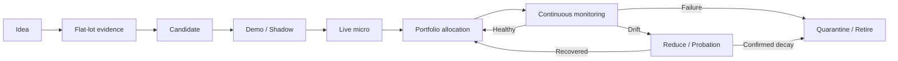

ผมคิดว่าที่คุณ “ตัน” ไม่ใช่เพราะ EA LAB ไปต่อไม่ได้ แต่เพราะมันกำลังเปลี่ยนเฟสครับ—จากโรงงานสร้าง EA ไปเป็น “ระบบบริหารกองทัพ EA และจัดสรรเงินทุน” งานต่อไปจึงไม่ควรเป็นการใส่ไอเดีย EA เพิ่มเป็นหลักแล้ว

## ภาพ Fast-forward ปี 2031

คุณเปิด Dashboard ตอนเช้าและเห็นสรุปแบบนี้:

> 10 บัญชี · 22 EA · พอร์ตปกติ · DD รวม 6.8% จากงบ 15% · ไม่มี config drift · EA 2 ตัวอยู่ probation · 1 ตัวแนะนำลดขนาด · วันนี้ไม่ต้องทำอะไร

Final product ที่เหมาะกับคุณคือ **EA Portfolio Operating System** ไม่ใช่แค่ EA Builder

ระบบควรมี 5 ส่วน:

1. **Research Factory**  
   รับไอเดีย → flat-lot probe → optimize → holdout → demo โดยเก็บประวัติทุกสมมติฐาน

2. **EA Fleet Manager**  
   รู้ว่า EA ตัวไหน รันที่บัญชีใด symbol/magic/set/binary เวอร์ชันอะไร และสถานะจริงตรงกับทะเบียนหรือไม่

3. **Live Monitoring & Drift Detection**  
   เปรียบเทียบพฤติกรรมจริงกับ backtest อย่างต่อเนื่อง ไม่รอแค่ judge date

4. **Portfolio Risk Allocator**  
   จัดน้ำหนักจาก volatility, DD overlap, currency exposure และ regime ไม่ใช่ให้ทุก EA lot เท่ากัน

5. **Human Decision Console**  
   ระบบเสนอ “คงไว้/ลด lot/พัก/ถอด/promote” พร้อมหลักฐาน แต่คุณเป็นคนอนุมัติการเปลี่ยนเงินจริง

จุดจบไม่ใช่ระบบซื้อขายเองทุกอย่าง จุดจบคือระบบทำงานวิเคราะห์และเฝ้าระวังเอง จนคุณเหลือหน้าที่ตัดสินใจเฉพาะเรื่องสำคัญ

## Monitor ที่ควรสร้าง

Monitor ไม่ควรเป็นเพียงกราฟกำไร แต่ควรตอบ 4 คำถามทุกวัน

### 1. ระบบยังทำงานถูกตัวหรือไม่

ตรวจทุก terminal:

- Online/heartbeat ล่าสุด
- Account, EA, symbol, magic
- Binary hash และ set hash ตรงทะเบียนหรือไม่
- Account เป็น hedging/netting ถูกประเภทหรือไม่
- SL ฝั่ง broker มีจริงหรือไม่
- News/Macro gate ยัง refresh หรือค้าง
- มี position/pending ที่ไม่มีเจ้าของหรือไม่
- Backup และข้อมูลล่าสุดอายุเท่าไร

นี่คือ “เครื่องบินยังประกอบครบหรือไม่” ก่อนถามว่าบินกำไรไหม

### 2. EA ยังทำตัวเหมือนตอนทดสอบหรือไม่

ต่อ EA ควรเทียบ live กับช่วงคาดหวัง:

- จำนวน trade ต่อสัปดาห์
- Win rate และ payoff
- Average holding time
- Spread/slippage จริง
- MAE/MFE
- จำนวนชั้นสูงสุดของ grid
- Lot progression ที่เกิดจริง
- เวลากำไร/ขาดทุนกระจุกตัว
- Equity DD เทียบกับ backtest band
- ระยะเวลาที่ basket ค้าง

ผลไม่ควรมีเพียงเขียว/แดง แต่มี 4 สถานะ:

- **NORMAL** — อยู่ในกรอบ
- **WATCH** — เริ่มเบี่ยง แต่ sample ยังน้อย
- **PROBATION** — เบี่ยงอย่างมีนัย ต้องลดความเสี่ยง
- **QUARANTINE** — config/safety ผิด หรือความเสี่ยงเกินกรอบ

### 3. พอร์ตโดยรวมกำลังพนันเรื่องเดียวกันหรือไม่

Portfolio monitor ต้องรวมทุกบัญชีและดู:

- Equity/DD รวม
- Risk contribution ต่อ EA
- Exposure ต่อ symbol และ currency
- กลไกซ้ำกัน เช่น breakout/grid/trend
- Correlation ช่วงปกติ
- DD overlap ช่วงตลาดเครียด
- Worst-case หากหลาย EA trip พร้อมกัน
- Margin รวมและ pending-margin reserve
- ผลกระทบหากทอง/USD/JPY เกิด shock

Correlation ปกติอาจต่ำ แต่ขาดทุนพร้อมกันใน crisis ได้ ดังนั้น DD-overlap สำคัญกว่า Pearson correlation เพียงตัวเดียว

### 4. เรามีข้อมูลพอตัดสินหรือยัง

Judge date ไม่ควรเท่ากับ verdict date เสมอไป ระบบต้องรายงานว่า:

- ถึง 15/30/100 trades หรือยัง
- Confidence interval กว้างแค่ไหน
- ต้องรออีกกี่เดือนจึงจะมีข้อมูลพอ
- Candidate นี้เป็น “decision-capable” หรือเพียง “data collection”
- Holdout ถูกใช้ select ไปแล้วหรือยัง
- มีการลอง parameter/hypothesis ไปกี่ครั้ง

นี่น่าจะเป็น blind spot ใหญ่ของระบบตอนนี้: EA บางตัวเทรดบางมาก สามเดือนผ่านไปก็ยังไม่มีข้อมูลพอ แต่ปฏิทินทำให้รู้สึกว่าถึงเวลาตัดสินแล้ว

## Roadmap จากตอนนี้

### 0–3 เดือน: ทำให้ระบบที่มีอยู่เชื่อถือได้

เป้าหมายไม่ใช่เพิ่ม EA แต่ทำให้รู้แน่นอนว่าอะไรทำงานอยู่

- ปิด safety residual ของ post-132
- ทำ terminal/config/build attestation
- Enumerate แถว UNVERIFIED ให้หมด
- ใส่ judge rule/date ต่อ deployment
- ทำ backup/restore drill จริงหนึ่งรอบ
- ทำ immutable evidence bundle ให้ candidate หนึ่งตัว
- เริ่มเก็บข้อมูล drift ที่จำเป็น
- จำกัด R&D ไม่เกินหนึ่ง concept ต่อสัปดาห์

Gate จบเฟส: ทุก exposure มีเจ้าของ มี config ตรวจสอบได้ และกู้ระบบกลับได้

### 3–6 เดือน: สร้าง Monitor V1

- Dashboard รวมทุก account
- Tracking-error bands ต่อ EA
- Data-quality/staleness alerts
- Judge-readiness forecast
- Weekly exception report
- Shadow recommendation: keep/watch/reduce/quarantine
- ยังไม่ให้ระบบเปลี่ยน lot หรือปิด EA อัตโนมัติ

Gate จบเฟส: monitor ตรวจพบ config drift หรือ behavior drift จริงอย่างน้อยหนึ่งกรณี และ false alarm อยู่ในระดับรับได้

### 6–12 เดือน: ประกอบ Portfolio #1 อย่างเป็นระบบ

- Multi-account equity combiner
- Currency/mechanism exposure map
- Stress DD-overlap
- Volatility/risk-budget sizing
- Portfolio-level circuit breaker แบบ shadow
- Promotion package ที่ reproducible
- เปิดพอร์ตถัดไปเมื่อ bench และหลักฐานพร้อม ไม่ใช่ตามวันที่

Gate จบเฟส: พอร์ตแรกเดินหนึ่งเดือนด้วย telemetry ครบ และ restore/incident drill ผ่าน

### ปีที่ 2: จาก EA หลายตัวเป็น Fleet

- 2–3 พอร์ตคุณภาพ
- Monthly report สร้างอัตโนมัติ
- Re-opt calendar และ version lineage
- Probation/quarantine workflow
- ลดขนาดอัตโนมัติได้เฉพาะหลัง human approval
- วัด survival rate ของ EA หลัง promote 6–12 เดือน
- เริ่มเรียนรู้ว่า funnel แบบใดผลิตของรอดจริง

### ปีที่ 3: ระบบเรียนรู้จากงานวิจัยของตัวเอง

- ฐานข้อมูล experiment และ hypothesis
- Deflated/multiple-testing gate
- รู้ว่า entry/mechanism/symbol family ไหนให้ผลตอบแทนต่อเวลาสูง
- ระบบแนะนำ “ช่องว่างในพอร์ต” ก่อนแนะนำ EA ใหม่
- Research queue ถูกสร้างจาก portfolio need ไม่ใช่จากไอเดียที่เข้ามาล่าสุด
- เป้าประมาณ 4–6 พอร์ต หากหลักฐานรองรับ

ตัวอย่างคำสั่งจากระบบในอนาคต:

> พอร์ตขาดกลไกที่ได้ประโยชน์จาก FX relative-value และมี XAU trend exposure สูงเกินไป — ให้ค้น concept pairs/triangular ก่อนสร้าง breakout ตัวที่ 8

### ปีที่ 4: ลด single-operator risk

- Runbook ครบ
- Credential recovery
- Cold restore ผ่านตามรอบ
- Monitoring failover
- Incident timeline อัตโนมัติ
- Backup operator สามารถทำตามคู่มือได้
- ระบบอยู่รอดแม้คุณไม่แตะ 1–2 สัปดาห์
- 6–8 พอร์ต หาก risk budget ยังรองรับ

### ปีที่ 5: EA Portfolio OS เต็มรูป

- 10 พอร์ตคุณภาพ ไม่จำเป็นต้องครบหาก edge ไม่พอ
- 2–3 EA ต่อพอร์ตตาม risk contribution
- Monitoring และรายงานเกือบอัตโนมัติ
- ระบบเสนอ allocation/promotion/retirement
- คุณอนุมัติการเปลี่ยนเงินจริง
- เวลา operate เป้าหมาย 1–2 ชั่วโมงต่อสัปดาห์
- R&D ทำตาม “ช่องว่างของพอร์ต” ไม่ใช่สะสม EA
- มีประวัติครบว่ากำไรเกิดจาก signal, sizing หรือ regime ใด

## วิธีหลุดจากวงจรใส่ไอเดีย EA เรื่อยๆ

เปลี่ยนสัดส่วนงานเป็น:

- **50% — Operate & observe**
- **25% — Evidence/promotion integrity**
- **15% — Portfolio construction**
- **10% — EA ideas ใหม่**

และใช้ WIP limit:

- Research พร้อมกันไม่เกิน 3 concept
- Concept ใหม่เข้าได้เมื่อมีตัวเก่าออกจาก funnel
- ไม่เกิน 1 concept ใหม่/สัปดาห์ หรือ 2 ตัว/เดือน
- ทุก concept ต้องตอบก่อนว่า “เติม payoff shape อะไรที่พอร์ตยังไม่มี”
- ถ้าตอบเพียง “PF อาจสูง” ยังไม่ควรสร้าง

North-star metric ไม่ควรเป็นจำนวน EA แต่เป็น:

> “จำนวนสัปดาห์ที่ระบบเดินถูกต้อง โดยใช้เวลาคุณน้อย และความเสี่ยงรวมอยู่ในกรอบ”

สรุปสั้นที่สุด: **Boss V2 คือเครื่องยนต์, EA LAB คือโรงงาน แต่ Final Product คือระบบบริหารพอร์ตและหลักฐาน** ตอนนี้คุณสร้างเครื่องจักรมาพอแล้ว งานที่มี EV สูงสุดคือสร้างห้องควบคุมให้มันครับ