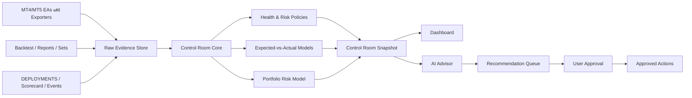

ตอนนี้คุณมี “ชิ้นส่วนห้องควบคุม” เกือบครึ่งแล้ว แต่ยังไม่มีแกนกลางที่รวมข้อมูล ตีความ และบอกว่า “วันนี้ควรทำอะไร” ปัญหาคือข้อมูลกระจายอยู่ใน CSV, Dashboard, taskboard, scorecard และเอกสารหลายจุด ทำให้ทั้งคุณและ AI ต้องประกอบภาพใหม่ทุกครั้ง

หลักการออกแบบที่ผมแนะนำคือ:

> EA เป็นเซนเซอร์และผู้ปฏิบัติ · Control Room เป็นความจริงกลาง · AI เป็นที่ปรึกษา · คุณเป็นผู้อนุมัติเงินและความเสี่ยง

## ของที่มีอยู่แล้ว

| ความสามารถ | ของที่มี | สถานะ |
|---|---|---|
| ทะเบียน deployment | `portfolio/DEPLOYMENTS.csv` | เป็นฐานที่ดี แต่ยังมี UNVERIFIED และข้อมูลบางส่วนไม่ครบ |
| ประวัติ trade รายบัญชี | `portfolio/live_deals/*.csv` | มีข้อมูลรายวันหลายบัญชีแล้ว |
| Floating-risk snapshot | AccountSnapshotExporter + collector | มีโครง แต่ coverage ยังไม่ครบทุก terminal |
| Daily automation | `scripts/daily_monitor.ps1` | มี rotation, collect, news, MRIS, dashboard, alert และ audit commit |
| Dashboard | `portfolio/LIVE_DASHBOARD.html` | แสดง PF/DD/floating/margin/stale/unmapped ได้แล้ว |
| Data freshness | stale guard 26–30 ชั่วโมง | ดีและ fail-visible |
| Macro/news awareness | MRIS, NewsGuard, MacroGate | มีระบบเตือนและ block/reduce-lot ระดับหนึ่ง |
| EA safety | Boss V2 RiskControl/kill/caps | ดีขึ้นมาก แต่ยังมี residual จาก post-132 ที่ต้องปิด |
| Research registry | scorecard, master index, taskboard | มีหลักฐานเยอะ แต่ authority ยังซ้ำและ sync มือ |
| Experiment history | Event log + evidence manifest | เป็นฐานสำหรับ AI อธิบายว่าทำไมเคยตัดสินแบบนั้น |
| Mobile view | Gist dashboard | ใช้งานได้ แต่ต้องแก้ privacy/credential hygiene |

สรุปคือ คุณมี sensor, collector และ dashboard แล้ว สิ่งที่ยังไม่มีคือ “สมองส่วนกลาง”

## ห้องควบคุมที่ควรสร้าง



แกนสำคัญที่สุดคือ `Control Room Core` ซึ่งควรเป็น Module ลึกตัวเดียว มี Interface เล็กๆ:

```text
Refresh()                  → ControlRoomSnapshot
Evaluate(snapshot)         → Findings
Propose(findings)          → ActionPlan
Execute(approvedActionPlan)
```

ความซับซ้อนทั้งหมด—อ่าน MT4/MT5, รวมบัญชี, ตรวจ stale, คำนวณ drift, หา evidence—ควรซ่อนอยู่หลัง Interface นี้

ข้อดีคือ Dashboard, AI, Telegram และรายงานรายสัปดาห์อ่าน Snapshot ก้อนเดียวกัน จึงไม่ตีความคนละแบบ

## Control Room Snapshot ควรมีอะไร

### 1. System Health

ตอบว่า “ตาและหูของระบบยังทำงานไหม”

- Terminal ไหน online/offline
- Exporter heartbeat ล่าสุด
- Snapshot อายุเท่าไร
- Daily chain สำเร็จหรือไม่
- News/Macro feed สดหรือค้าง
- Backup ล่าสุด
- Account ไหนยัง UNVERIFIED
- มี magic ที่พบใน terminal แต่ไม่มีในทะเบียนหรือไม่

### 2. Deployment Attestation

ตอบว่า “สิ่งที่รันจริงตรงกับของที่อนุมัติไหม”

ต่อ EA ต้องรู้:

- Account
- Platform
- Symbol
- Magic
- EA name
- Binary hash
- Set hash
- Source/evidence version
- Hedging/netting mode
- Server-side SL มีจริงหรือไม่
- Kill rule
- Judge rule/date
- สถานะ DEMO/LIVE/REMOVED
- เวลา attach/restart ล่าสุด

จุดนี้จะกำจัด `$cohort` hardcoded ขนาดใหญ่ใน `live_dashboard.ps1` ให้ Dashboard generate จาก `DEPLOYMENTS.csv` และ Snapshot โดยตรง

### 3. Live Risk

ตอบว่า “ตอนนี้กำลังเสี่ยงอะไรอยู่”

- Balance/equity/floating
- Margin และ stop-out distance
- Exposure ต่อ symbol/currency
- Lot รวมทุกบัญชี
- Pending margin
- Basket ที่ค้างนานผิดปกติ
- Grid depth/lot progression
- EA ใกล้ kill threshold
- Portfolio DD และ risk budget ที่ใช้ไป

### 4. EA Health

ตอบว่า “EA ยังมีพฤติกรรมเหมือนตอนที่เราทดสอบหรือไม่”

ต่อ EA เปรียบเทียบ live กับ locked backtest:

- Trade rate
- Win rate
- Average win/loss
- PF พร้อมช่วงความไม่แน่นอน
- Holding time
- Spread/slippage
- MAE/MFE
- Layer depth
- Recovery duration
- Time-of-day distribution
- Long/short ratio
- DD path

สถานะที่แสดงควรแยกจาก verdict:

- `NORMAL`
- `WATCH`
- `PROBATION`
- `QUARANTINE`
- `DATA_INSUFFICIENT`
- `CONFIG_DRIFT`

เช่น EA อาจยังเป็น `DEMO` แต่มี health=`WATCH` ได้ โดยไม่ต้องเปลี่ยน verdict ทันที

### 5. Judge Readiness

ตอบว่า “มีข้อมูลพอตัดสินหรือยัง”

- จำนวน trade ปัจจุบัน
- คาดว่าจะมี trade เท่าไรเมื่อถึง judge date
- โอกาสถึง 15/30/100 trades
- Confidence interval กว้างแค่ไหน
- Holdout ถูกใช้ select ไปแล้วหรือยัง
- Evidence bundle ครบกี่เปอร์เซ็นต์
- Decision-capable หรือ data-collection only

### 6. Research Pipeline

ตอบว่า “ควรวิจัยอะไรต่อ ไม่ใช่แค่มีไอเดียอะไรเข้ามา”

- Concept ที่กำลังทำ
- WIP limit
- Funnel stage
- สมมติฐานที่ทดสอบไปแล้ว
- Parameter/hypothesis count
- เหตุผลที่ตาย
- กลไกที่นำกลับมาใช้ได้
- พอร์ตยังขาด payoff shape แบบใด
- Expected information gain ต่อเวลา/ค่าเครื่อง

Research queue ในอนาคตควรถูกสร้างจาก “ช่องว่างของพอร์ต” เช่น:

> XAU trend exposure สูง แต่ไม่มี relative-value leg → ให้ pairs/triangular concept มาก่อน breakout ตัวใหม่

## หน้าจอ Control Room

ไม่ควรเริ่มจากเว็บสวยๆ ควรเริ่มจากข้อมูลถูกก่อน เมื่อข้อมูลพร้อม ผมแนะนำ 6 หน้า

### 1. TODAY

หน้าที่คุณเปิดทุกเช้า

```text
SYSTEM        5/7 accounts fresh · 2 accounts need attention
PORTFOLIO     DD 4.8% / budget 15% · XAU risk 57% สูง
EA HEALTH     21 normal · 3 watch · 1 config drift
JUDGE         2 decision-capable · 9 data-insufficient
ACTIONS       3 รายการรออนุมัติ
```

ด้านล่างมีเพียง:

- ต้องทำวันนี้
- ทำภายในสัปดาห์
- ยังไม่ต้องทำ
- สิ่งที่ระบบจัดการเองแล้ว

### 2. FLEET

ทุก account/EA/magic/config/heartbeat พร้อมสถานะ attestation

### 3. RISK

Exposure, portfolio DD, margin, symbol/currency concentration และ stress scenario

### 4. EA HEALTH

Expected-vs-actual, drift, judge readiness และ timeline ต่อ EA

### 5. RESEARCH

Candidate funnel, experiment budget, dead pile, build-on และช่องว่างของพอร์ต

### 6. ADVISOR & ACTIONS

สนทนากับ AI และดู Action Queue ว่าอะไร:

- AI แนะนำ
- Policy บังคับ
- ทำอัตโนมัติแล้ว
- รอคุณอนุมัติ
- ปฏิเสธแล้วพร้อมเหตุผล

## AI จะช่วยคุณอย่างไร

AI ไม่ควรอ่านไฟล์กระจัดกระจายแล้วเดาใหม่ทุกครั้ง แต่ควรอ่าน `ControlRoomSnapshot` ซึ่งผ่านการตรวจความสอดคล้องแล้ว

ทุกคำแนะนำต้องตอบในรูปแบบเดียว:

```text
FACT         สิ่งที่เกิดขึ้นจริง
INTERPRET    ความหมายที่เป็นไปได้
ACTION       สิ่งที่แนะนำ
EVIDENCE     ไฟล์/ข้อมูล/ช่วงเวลาที่รองรับ
CONFIDENCE   สูง/กลาง/ต่ำ
APPROVAL     ต้องให้ user อนุมัติหรือไม่
```

ตัวอย่าง:

> FACT: Boss_17 XAG มี 2 trades ใน 31 วัน ต่ำกว่าค่าคาดหวัง percentile 10  
> INTERPRET: อาจเป็น regime dormancy หรือ config/data drift; sample ยังไม่พอสรุป edge decay  
> ACTION: ตรวจ set hash และ entry heartbeat ก่อน ห้าม optimize หรือถอด EA ตอนนี้  
> EVIDENCE: deployment 990302, demo snapshot 31 วัน, locked backtest trade-rate  
> CONFIDENCE: กลาง  
> APPROVAL: ไม่ต้องอนุมัติสำหรับการตรวจข้อมูล

### AI ช่วยได้ทันที

- สรุปสถานการณ์ประจำวัน
- ตรวจความขัดแย้งระหว่าง CSV/scorecard/taskboard
- บอกว่า order ใดมี EV สูงสุดถัดไป
- ร่าง order พร้อม acceptance criteria
- อธิบาย alert เป็นภาษาคน
- แยก data problem ออกจาก EA problem
- เตือนว่าหลักฐานยังไม่พอ
- สร้าง weekly operating brief
- ตรวจว่า experiment ซ้ำกับของที่เคยตายหรือไม่

### AI ช่วยได้เมื่อมี Drift Model

- เปรียบเทียบ live กับ backtest
- บอกว่า deviation ใดเป็น noise หรือผิดปกติ
- ประเมิน judge readiness
- เสนอ probation/reduce-lot
- แนะนำข้อมูลที่ต้องเก็บเพิ่ม
- หา regime ที่ EA กำลังแพ้
- เลือก experiment ที่ให้ information gain สูงสุด

### AI ช่วยได้เมื่อมี Portfolio Model

- เสนอขนาด lot ตาม risk contribution
- ตรวจ symbol/currency/mechanism concentration
- จำลอง “ถ้าทองลง 8% พร้อม USD shock”
- แนะนำว่าจะวาง EA ตัวใหม่ในพอร์ตใด
- เสนอ EA ที่ควรลดน้ำหนักแทนการถอด
- แนะนำ payoff shape ที่พอร์ตยังขาด
- สร้างแผนเปิด account ถัดไป

## ระดับอำนาจของ AI

เพื่อไม่ให้ AI กลายเป็นความเสี่ยงใหม่ ควรแบ่งเป็น 4 ระดับ

| ระดับ | AI ทำอะไรได้ |
|---|---|
| **L0 Observe** | อ่านข้อมูล สรุป ตรวจ drift |
| **L1 Recommend** | เสนอ action/order/experiment แต่ไม่เปลี่ยนอะไร |
| **L2 Safe Ops** | refresh data, regenerate dashboard, backup, retry exporter, เปิด issue |
| **L3 Risk Reduction** | block new entries/reduce risk เฉพาะ policy ที่คุณอนุมัติล่วงหน้า |
| **L4 Money Decision** | promote, เพิ่ม lot, โอนเงิน,เปลี่ยน live config—ต้องให้คุณอนุมัติทุกครั้ง |

ช่วง 6–12 เดือนแรกควรอยู่ L0–L2 เท่านั้น

L3 เปิดได้หลังมี shadow test และ incident drill ส่วน L4 ไม่ควร autonomous แม้ในปีที่ห้า

## Roadmap การสร้างห้องควบคุม

### CR-001 — Single Snapshot

ระยะประมาณ 1–2 สัปดาห์

- กำหนด schema `ControlRoomSnapshot`
- อ่าน deployment จาก CSV แหล่งเดียว
- Generate cohort map แทน hardcode
- รวม freshness/account/EA/floating/deal state
- แสดง missing/unverified fields
- ยังไม่ทำ AI

**ผลลัพธ์:** คำสั่งเดียวสร้างภาพระบบครบก้อนเดียว

### CR-002 — Sensor Coverage & Attestation

ประมาณ 2–4 สัปดาห์

- Exporter ครบทุก account
- Binary/set hash
- Account mode
- Server-side SL
- Terminal heartbeat
- Unknown magic detection
- Judge date/rule completeness
- Backup/restore canary

**ผลลัพธ์:** รู้ว่าสิ่งที่รันจริงตรงกับทะเบียน

### CR-003 — Deterministic Health Engine

ประมาณ 3–5 สัปดาห์

- Policy NORMAL/WATCH/PROBATION/QUARANTINE
- Stale/config drift/missing SL
- Margin/DD/concentration
- Judge readiness
- Action Queue
- Replay test จาก snapshot เก่า

**ผลลัพธ์:** ระบบบอก “อะไรผิดและควรทำอะไร” ด้วยกฎที่ตรวจสอบได้ โดยยังไม่ใช้ AI ตัดสิน

### CR-004 — TODAY Dashboard + AI Advisor V1

ประมาณ 2–3 สัปดาห์

- Today screen
- Weekly operating brief
- AI อ่าน Snapshot + Findings
- ทุกคำแนะนำมี evidence/confidence/approval
- AI ร่าง taskboard order ได้ แต่ไม่เขียน verdict เอง

**ผลลัพธ์:** คุณเริ่มใช้ห้องควบคุมเป็นผู้ช่วยงานประจำวัน

### CR-005 — Drift & Judge Engine

ประมาณ 1–2 เดือน

- Locked expected profile ต่อ EA
- Trade-rate/PF/holding/slippage bands
- Thin-sample uncertainty
- Decision-capable forecast
- Shadow alerts 30 วัน
- False-positive review

**ผลลัพธ์:** ไม่ต้องรอสามเดือนแล้วดู PF ตัวเดียว

### CR-006 — Portfolio Control

หลังข้อมูล CR-001–005 นิ่ง

- Multi-account equity curve
- Risk contribution
- DD overlap
- Currency/mechanism exposure
- What-if simulation
- Allocation recommendation
- Portfolio circuit breaker แบบ shadow

**ผลลัพธ์:** เริ่มเปลี่ยนจากกอง EA เป็นพอร์ตจริง

### CR-007 — Semi-autonomous Operations

ปีที่ 2 เป็นต้นไป

- Retry/repair exporter
- Backup verification
- Incident timeline
- Telegram action queue
- Pre-approved risk-reduction actions
- Human approval สำหรับเงินจริง
- Monthly/quarterly governance report

## เทคโนโลยีที่เหมาะกับของเดิม

ไม่จำเป็นต้องสร้าง cloud platform ใหญ่ ผมแนะนำ local-first:

- CSV เดิมเก็บเป็น raw evidence
- SQLite หนึ่งไฟล์เป็นสถานะกลาง
- Python/PowerShell adapters อ่าน MT4/MT5/Git
- Snapshot JSON เป็น Interface ให้ Dashboard และ AI
- HTML dashboard แบบ static ใช้ต่อได้
- Telegram/Gist เป็น output adapter
- Replay adapter ใช้ snapshot เก่าทดสอบ policy โดยไม่แตะ terminal

จุดสำคัญจากแนวทาง `codebase-design` คืออย่าสร้าง script เพิ่มสิบตัวที่ต่างคนต่างอ่าน CSV แต่สร้าง `Control Room Core` เป็น Module ลึกตัวเดียว แล้วให้ Dashboard, AI และ automation เรียก Interface เดียวกัน

## สิ่งแรกที่ควรทำจริง

ลำดับที่ผมเลือกคือ:

1. ปิด residual post-132 ก่อน rollout live  
2. ทำ `ControlRoomSnapshot`  
3. ลบ cohort hardcode ออกจาก Dashboard  
4. ทำ attestation และ exporter coverage ให้ครบ  
5. ทำ TODAY screen แบบยังไม่มี AI  
6. เพิ่ม deterministic recommendation  
7. ค่อยให้ AI อธิบายและจัดลำดับงาน  
8. Drift engine  
9. Portfolio risk layer  
10. Semi-autonomous operations

ห้องควบคุมที่ดีไม่ใช่ห้องที่มีกราฟเยอะที่สุด แต่เป็นห้องที่เปิดมาแล้วตอบคุณได้ทันทีสามข้อ:

> ตอนนี้ปลอดภัยไหม · อะไรต้องทำวันนี้ · หลักฐานพอให้ตัดสินหรือยัง

เมื่อสามข้อนี้ตอบได้อัตโนมัติ AI จะเริ่มเป็น “ผู้ช่วยบริหารแล็บ” จริงๆ ไม่ใช่แค่คนช่วยคิด EA ตัวต่อไปครับ