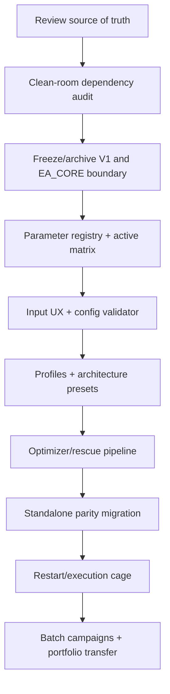

# EA_CORE / Boss V2 — Master Workplan for Claude

> # 🔴 REV-B — อ่านบล็อกนี้ก่อนใช้แผนข้างล่าง (2026-07-23, Opus-seat + Codex QA)
>
> แผนเดิม (rev-A ข้างล่าง) **ทิศทางรับได้ ~80% แต่ห้ามแตกเป็น order ตามที่เขียน** — reviewed โดย Opus
> (7 finding) แล้ว Codex QA ซ้ำ (AGREE 4 / PARTIAL 3 / ไม่มี DISAGREE + จับเพิ่ม 4 ข้อที่ Opus พลาด).
> เนื้อ rev-A เก็บไว้ครบเพื่อตรวจย้อน · **ข้อขัดแย้งใดๆ ให้ REV-B ชนะ**. order ติดตาม = ORDER-155.
>
> ## B1 — 🚫 BLOCKER: OPT-004/005 สร้างระบบ verdict ซ้อน
> rev-A ประดิษฐ์สถานะ `SCREEN_FAIL`/`REOPT_PENDING`/`PROFILE_FAIL`/`ROBUST_FAIL`/`OOS_FAIL`/`RISK_FAIL`/`DEAD`
> + rescue ladder R0–R4 · แต่ **VERDICT GATE ใน `CLAUDE.md` = owner ของ verdict ทั้งหมด** (vocabulary ล็อกแล้ว:
> `DEAD-STRUCTURAL · DEAD-OPTIMIZED · PARKED-VERIFY(user) · BUILD-ON · CANDIDATE · DEMO · LIVE` + bar table
> หนึ่งเลขต่อ transition ที่ user ratify) และ **THE LADDER = skill `backtest-optimize-rigor`**.
> **แก้:** สถานะพวกนี้ใช้ได้เฉพาะเป็น *pipeline-stage label ภายใน tooling* ที่ map กลับ canonical vocabulary
> เสมอ **ห้ามเป็น verdict / ห้ามลง scorecard** — ตาราง map ทำไว้แล้วที่ `ea_template/OPTIMIZATION_PROCEDURE_V2.md`
> §13.0 (ORDER-152). ส่วน **OPT-005 ที่แตะเลข PF/DD/ruin = แยกเป็นคำถามให้ user เคาะ ไม่ใช่ order**
> — *แต่* trade-floor ต่าง ๆ ตาม strategy type **ไม่ต้องถาม**: bar table เดิมเขียน "n เหมาะกับ type" รองรับอยู่แล้ว
> (Codex จับจุดนี้ — Opus เผลอเหมารวมว่าต้องถามทั้ง OPT-005)
>
> ## B2 — Model routing ขัดบทเรียนที่จ่ายไปแล้ว
> rev-A §2 ให้ **Codex-direct เขียนโค้ด** และ MIG-002 ให้ "Codex/Sonnet code" · ขัด Decision log 2026-07-16
> (Codex-builder ตาย 3 ครั้งใน 1 วัน → โค้ดสำคัญ Claude เขียน Codex audit).
> **แก้:** `core/parity/money code = Claude เขียน + Codex blind-audit` · `tooling ไม่แตะเงิน + มี cage = Codex/Sonnet เขียนได้`
> (precedent ORDER-144). **หมายเหตุ: "ตัด Codex ออกจากเลน implement ทั้งหมด" ของ Opus กว้างเกินไป — Codex แก้ให้ถูกแล้ว.**
> เส้นแบ่งฉบับทางการ = `AGENTS.md` §5.2 (เขียนแล้ว ORDER-152).
>
> ## B3 — OPT-002 ต้อง pin window ด้วยโค้ด ไม่ใช่ด้วยความตั้งใจ
> rev-A พูด "MAIN IS / OOS / holdout" ลอย ๆ ไม่ pin และไม่พูดถึงกฎเหล็ก `MAIN ∩ HOLDOUT = ∅` ที่ Codex เอง
> จับ leakage ได้เมื่อ 2026-07-18. **แก้:** acceptance ของ OPT-002 ต้องบังคับ (1) อ่าน pin จาก **source เดียว**
> ที่ re-pin ได้ (ไม่ copy วันที่ตายตัวหลายไฟล์) (2) **assert disjoint** ปฏิเสธการรันถ้า window กิน holdout
> (3) เก็บ **สถานะ holdout-burn ราย EA** — 2026H1 ไหม้แล้วสำหรับ Wave-2 S1 (ORDER-139).
>
> ## B4 — กฎที่ ratify แล้วแต่หายไปจากแผน (เติมให้ครบ)
> (a) **ENGINE-EDGE class** (user rule 2026-07-19) — gate ของ grid/DCA ต้อง encode กรง 5 ข้อ: worst-case ≤15%
> equity · BWD = **hard** gate · Model-4 บังคับ · MC ruin ≤2% · label engine-edge + sizing เล็กถาวร
> (b) **exit/time lever บน grid ต้อง M4 เสมอ** — บทเรียน ORDER-125: M1 หลอกผ่าน (BWD 1.23) M4 พลิกตาย (0.85);
> grid recovery-tail = engine ห้าม time-cut → ARCH-001/OPT-002 ต้องระบุว่า preset ไหนบังคับ M4
> (c) **Row-X write-checklist** — order ที่ *ผลิต verdict* ต้องแตะ scorecard + EA_MASTER_INDEX (hook บังคับ) +
> EDGE_CATALOG + `B1_DATASET.csv` ใน commit เดียวกัน (Codex: ใช้เฉพาะ order ที่ออก verdict ไม่ใช่ทุกใบ)
> (d) **field `bars:` / `flat-lot probe:`** ตาม ORDER TEMPLATE ของ `AGENT_TASKBOARD.md` + ขั้น pre-compile
> source review ของ `docs/PIPELINE.md` — DoD ของ rev-A ไม่มีสักข้อ
>
> ## B5 — งานที่ทับของที่ปิดไปแล้ว → เปลี่ยนเป็น gap-audit
> **CAGE-001** ทับ ORDER-129/132/138 ที่ปิดแล้ว (`RC_AdoptLegacyHalt` fail-closed · pair marker complete-or-none ·
> closeall intent persisted · Codex audit 2 รอบ) → เปลี่ยนเป็น **audit ช่องว่างเทียบของที่ทำแล้ว** ไม่ใช่สร้างใหม่
> (ส่วนที่ยังเป็นของใหม่จริง = failure injection ทั่วไป + netting/hedging).
> **CORE-001 / CORE-003 = รื้อ decision ที่ปิดไปแล้ว** (Boss V2 = แม่พิมพ์เดียว · EA_CORE = read-only archive
> ตัดสินแล้วใน VISION + Decision log + MERGE-08) → **ตัดทิ้ง หรือเหลือ read-only gap-audit** (Codex จับ — Opus พลาด).
>
> ## B6 — ตัวเลขใน rev-A ที่ผิด (Codex ตรวจของจริง)
> - แผนมี **23 proposed orders** ไม่ใช่ ~17
> - `ea_template/core/Inputs.mqh` มี **177 parameter จริง** — 202 บรรทัดขึ้นต้น `input` แต่ **25 บรรทัดเป็น
>   `input group` header** → PARAM-001 ต้องใช้เลข 177
> - **CONFIG-001 ไม่ได้เริ่มจากศูนย์**: `LabCore.OnInit()` + `RiskControl_InitEx()` มี fail-closed validation
>   คลัสเตอร์อยู่แล้ว (ไม่มี validator กลางไฟล์เดียว ≠ ไม่มี validation) → **เริ่มด้วย inventory ของเดิมก่อน**
> - `scripts/set_from_robust.py` **ยังไม่มี `--center`** จริง (OPT-001 ถูกต้อง) แต่ก็ **ไม่ใช่ "หยิบ pass แรก"**
>   แบบที่ Opus เขียน — มันหยิบ top robust-score survivor ผ่าน `select_robust_pass.py` แล้วค่อยหาแถวดิบที่ตรง
>
> ## B7 — ลำดับ + เลข order
> - **ห้ามชี้ `OPTIMIZATION_PROCEDURE_V2.md` เป็น spec owner ก่อน ORDER-152(b) เสร็จ** — ไม่งั้นย้ายปัญหา
>   vocabulary ไปอีกไฟล์ (Codex จับ · ✅ ORDER-152(b) ทำเสร็จแล้ว 2026-07-23 → ข้อนี้ปลดแล้ว)
> - **OPT-003** ต้องอ้าง freeze guard ใน `scripts/mt5_run.ps1` + gotcha tester ชนกันได้ 0-trade artifact
> - **เลข order:** จอง `ORDER-1xx` จริงบน taskboard ตอนแตก · เก็บ `CORE-`/`PARAM-`/`OPT-` ไว้เป็น tag ใน title
>   (เคยชนกันมาแล้ว 133→135 / 134→136)
> - **pacing:** แตก 1-2 order/รอบ · **เริ่มที่ CORE-002 (dependency audit script) + PARAM-001 (registry 177 ตัว)**
>   — สองใบนี้เป็นฐานของทุกอย่างและไม่แตะ source
>
> ---
>
> **สถานะ rev-A ข้างล่าง: DRAFT FOR REVIEW (superseded บางส่วนโดย REV-B ข้างบน)**
>
> เอกสารนี้รวบรวมงานที่คุยกันใน session: ทำให้ Boss V2 เป็น active system เดียว, ทำให้ EA_CORE V1 เป็น archive/reference ที่ไม่เป็น dependency, จัดระเบียบ parameter, สร้าง optimization/test pipeline ที่อธิบายได้, รองรับ rescue optimization และ port standalone เข้า template อย่างมี parity
>
> เอกสารนี้เป็นแผนเสนอให้ Claude review แล้วแตกเป็น order ลง `AGENT_TASKBOARD.md` ตามกติกาโครงการ ไม่ใช่การอนุมัติให้แก้ทุกอย่างในครั้งเดียว

## 1. เป้าหมายปลายทาง

```text
EA_CORE V1
  = read-only archive / parts reference
  = ไม่เป็น runtime dependency ของ Boss V2

Boss V2 (`D:\EA_LAB\ea_template`)
  = active chassis เดียวของโรงงาน
  = compile/test/deploy ได้โดยไม่ต้องใช้ EA_CORE V1

Standalone EA
  = temporary research lane
  = เมื่อพิสูจน์ edge แล้วต้อง port เข้า Boss V2 พร้อม parity evidence

Optimization system
  = profile → architecture → parameter hypothesis → coarse → IS → plateau → OOS → M4 → stress → portfolio
```

หลักใหญ่:

> **หนึ่ง batch = หนึ่ง hypothesis · หนึ่ง profile = หนึ่งหน่วยสเกล · หนึ่ง optimizer = parameter ภายใน architecture เดียว · FAIL ยังไม่ใช่ DEAD จนกว่าจะผ่าน rescue ladder**

## 2. Model routing

| งาน | Model ที่แนะนำ | เหตุผล |
|---|---|---|
| ตัดสิน architecture, source of truth, scope, verdict | **Claude Opus-seat** | งานคิด/ทิศทาง/decision เป็นของ Claude ตาม role |
| แตก order และ acceptance criteria | **Claude Opus-seat** | ต้องรักษา invariant และไม่ให้ scope drift |
| code ตาม pattern มี cage ชัด | **Sonnet fast-worker หรือ Codex-direct** | งาน mechanical/modular คุ้ม quota |
| parameter registry/เอกสาร/CSV generator แบบตรง pattern | **Sonnet** | งาน deterministic มี acceptance ตรวจได้ |
| optimizer script ที่กระทบผลการคัด candidate | **Codex second opinion + Claude review** | ผลกระทบสูงและย้อนตรวจยาก |
| risk/config validator ใหม่ | **Claude Opus ทำ design + Codex blind review** | เป็น money/risk logic ใหม่ |
| architecture เปลี่ยนแม่พิมพ์ | **Claude Opus + Codex mandatory second opinion** | เป็นการเปลี่ยนที่แพงและย้อนกลับยาก |
| batch run/parse ล้วน | **ZCode/qwen/Claude ตาม lane** | ไม่ควรใช้ ChatGPT model แพงกับ zero-judgment batch |
| Fable | **ไม่ใช้กับ workplan นี้** | Fable reserve เฉพาะ ST03 verdict, ORDER-082 spec, first live promotion, live RCA ตาม `AGENTS.md` |

ข้อควรจำ: Sonnet ไม่ควรตัดสินว่า EA ดี/ตาย และ Codex ไม่เป็นผู้ตัดสิน verdict ของโครงการ; Codex ให้ evidence/second opinion ตาม scope

## 3. Phase map



ห้ามข้าม A–E แล้วรีบทำ batch ใหญ่ เพราะจะได้ผลที่ตีความไม่ได้

## 4. Proposed order list

### Phase A — Source of truth และ boundary

#### CORE-001 — Confirm active/archived boundary

**Owner:** Claude Opus review + Codex scope check

**งาน:** ยืนยันเอกสารว่า:

- `D:\EA_Project\CURRENT_BUILD\CORE` = EA_CORE V1 read-only archive
- `D:\EA_LAB\ea_template\core` = Boss V2 active core
- `EA_LabTemplate.mq5` + `modules/` = V1 legacy path
- Boss V2 ไม่ส่งกลับไป build บน EA_CORE
- standalone เป็น temporary lane

**Acceptance:** source-of-truth table อยู่ในเอกสารหลัก, ไม่มีข้อความขัดกันใน `VISION.md`, `PROJECT_STATE.md`, `README.md`, `DESIGN_V2.md`

**ห้าม:** ลบ/ย้าย source ใน order นี้

#### CORE-002 — Clean-room dependency audit

**Owner:** Sonnet implement script, Claude review

**งาน:** สร้าง `scripts/check_template_dependencies.ps1` ตรวจว่า Boss 11–18 และ active runtime include/path ไม่อ้าง `EA_CORE`, `D:\EA_Project` หรือไฟล์ archive

**Acceptance:**

- Boss 11–18 compile จาก `ea_template` โดยไม่ต้องเปิด EA_CORE
- script fail เมื่อพบ forbidden dependency
- test helper ภายนอกถูกแยกเป็น test support dependency ไม่ปน runtime
- รายงาน dependency graph เก็บเป็น artifact

#### CORE-003 — V1 legacy isolation

**Owner:** Claude design, Sonnet/Codex implementation after approval

**งาน:** วางแผน archive สำหรับ `EA_LabTemplate.mq5` + `modules/` โดยยังไม่ลบ และตรวจว่าไม่มี active workflow ใช้

**Acceptance:**

- current README ชี้ V2 เป็น path หลัก
- V1 ระบุ legacy/frozen ชัด
- ไม่มี code ใหม่เพิ่มใน `modules/`
- archive move/rename ทำเฉพาะหลัง user/Claude approve และมี recovery path

### Phase B — Parameter registry และ UX

#### PARAM-001 — Full parameter registry

**Owner:** Sonnet ทำ extraction/ตาราง, Claude review semantics

**งาน:** trace ทุก `input` ใน `core/Inputs.mqh` ไปยัง implementation จริง และสร้าง registry ที่มี:

- name
- owner
- unit
- context
- active when
- coupled parameters
- default profile
- optimize stage
- safe range
- causal question

**Acceptance:** input ทุกตัวเป็น ACTIVE, INACTIVE, OVERRIDE หรือ COMPATIBILITY; ไม่มี input ที่ไม่ถูกจัดประเภท

#### PARAM-002 — Duplicate/linkage audit

**Owner:** Claude Opus design + Codex blind review

**งาน:** ตรวจ parameter ที่อาจซ้ำหรืออ่านสับสน เช่น:

- Signal ATR vs Risk ATR
- Stack step vs Recovery step
- Entry arm distance vs Stack add distance
- Leg TP vs Basket TP
- First lot vs progression
- Max levels vs risk cap
- generic exit/SL vs Boss 16/17 owner-specific exit

**Acceptance:** มี linkage diagram และตาราง owner; ทุกคู่ที่ดูซ้ำตอบได้ว่าต่างกันอย่างไร หรือมี order รวม owner

#### PARAM-003 — Canonical display groups and numbering

**Owner:** Claude design + Sonnet implementation

**งาน:** จัดกลุ่ม user-facing เป็น Profile, Entry, Exit, Stop, Filter/Regime, Stack, MM, Recovery, Hedge, Safety, Execution พร้อม canonical display IDs เช่น `E1x`, `X2x`, `S3x`, `K5x`, `M6x`, `R7x`, `H8x`, `C9x`, `Q0x`

**Acceptance:** ยังไม่ทำลาย `.set` เดิม; old key mapping มีเอกสาร; input group อ่านได้โดยไม่ต้องเปิด implementation

#### PARAM-004 — Remove/hide unrelated parameter surface

**Owner:** Claude design + Sonnet implementation

**งาน:**

- Zeus/GridLog-only อยู่ในกลุ่ม Boss 14
- Kangaroo-only อยู่ในกลุ่ม Boss 16
- Wave5 structural controls อยู่ใน Boss 17
- MacroGate เป็น advanced backtest A/B
- inactive generic inputs ถูกซ่อนเมื่อทำได้ หรือมี explicit WARN/registry flag

**Acceptance:** Boss แต่ละตัวเห็นเฉพาะ input ที่ active/compatibility/advanced ของตัวเอง; inactive input optimizer guard ถูกปฏิเสธ

#### PARAM-005 — Rename ambiguous labels safely

**Owner:** Claude design + Codex review

**งาน:** แก้คำอธิบาย `Evaluate`, `Adaptive`, `Aggressive`, `GridAgainst`, `Pyramid`, `Pip`, `Points` ให้ระบุ mechanism/unit โดยไม่เปลี่ยน key จนกว่าจะมี migration order

**Acceptance:** ผู้ใช้ตอบได้ว่า parameter คุมอะไร, ใช้ mode ไหน, หน่วยอะไร, ค่ามากขึ้นทำอะไร และ link กับอะไร

### Phase C — Configuration safety

#### CONFIG-001 — Centralized configuration validator

**Owner:** Claude Opus design + Codex mandatory second opinion + Sonnet implementation

**งาน:** เพิ่ม validator กลางก่อน `OnInit` ตรวจ legal combinations, inactive settings, exit-owner conflicts, missing SL, invalid caps, pending mode และ owner-specific overrides

**Severity:** safety false/missing → INIT_FAILED; declared-but-ignored → WARN; legal → no repeated warning

**Acceptance:** validator อยู่จุดเดียว, tests ครบ valid/warn/fatal, baseline regression unchanged

#### CONFIG-002 — Optimizer active-parameter guard

**Owner:** Sonnet implementation + Codex audit

**งาน:** ตรวจ `.set` ก่อน optimize:

- reject inactive keys
- reject safety keys
- reject mode combinationsที่ไม่มี owner
- enforce max tunable parameter count per stage
- emit parameter-to-owner manifest

**Acceptance:** optimizer ไม่ยิง parameter ที่ไม่มีผล; report ระบุ active optimized keys

### Phase D — Instrument profiles และ architecture presets

#### PROFILE-001 — Instrument profile base sets

**Owner:** Claude define schema; batch agent generate/measure values

**งาน:** สร้าง base profile สำหรับ FX major, FX JPY/cross, Gold, Crypto, Index/Oil ตาม brokerจริง:

- digits/point/pip rule
- ATR signal/risk context
- spread/commission assumptions
- lot/min volume
- fixed-pip baselineถ้าจำเป็น
- risk/protection defaults

**Acceptance:** profile ไม่ปน entry optimization; ทุกค่าเป็น screening prior ไม่ใช่ verdict; มี ATR snapshot evidence

#### ARCH-001 — Architecture preset matrix

**Owner:** Claude Opus design + Codex review

**งาน:** สร้าง preset แยก:

- Single trend
- Breakout single
- Mean-reversion controlled DCA
- Trend stack
- GridLog/Zeus
- Pyramid pending
- Structural/Wave single

แต่ละ preset lock Entry/Exit/SL/Stack/MM/Recovery/Hedge ที่ไม่ใช่ hypothesis

**Acceptance:** หนึ่ง preset = หนึ่ง strategy hypothesis; optimizer ไม่เลือกข้าม architecture ใน batch เดียว

#### PROFILE-002 — Default/fixed-pip policy

**Owner:** Claude/user decision

**งาน:** ตัดสินค่าตั้งต้น Gold/FX/Crypto และกำหนดว่า fixed pip เป็น baseline หรือ specialist mode

**Acceptance:** มีตาราง profile + rationale + unit; fixed pip ไม่ถูก copy ข้าม class โดยไม่มี calibration

### Phase E — Optimization engine และ rescue

#### OPT-001 — Fix plateau-center selection

**Owner:** Sonnet implementation + Codex review

**งาน:** `set_from_robust.py` ต้องรองรับ `center` และ default เป็น plateau center ไม่ใช่ robust pass ตัวแรก

**Acceptance:** generated `.set` ระบุ pick type, center params, neighbour count และ provenance; test fixture ครอบ center/robust ต่างกัน

#### OPT-002 — Rewrite optimize loop by stages

**Owner:** Claude Opus design + Sonnet implementation

**งาน:** แยก workflow เป็น baseline → coarse → MAIN IS → plateau/neighbour → OOS/year split → M4 → stress

**Acceptance:** loop บังคับ source hash, base set, active parameter manifest, windows, model, reports และไม่ใช้ holdoutเลือกซ้ำเงียบ ๆ

#### OPT-003 — 10,000-combination controlled batch

**Owner:** Claude define policy; ZCode/qwen/Claude run batch

**งาน:** อนุญาต 10,000+ combinations เมื่ออยู่ใน architecture/profile เดียวและมี time budget, output provenance, expected finalist ratio และ lane policy

**Acceptance:** batch manifest ก่อนเริ่ม; ไม่มี mixed architecture/class; result CSV รวมทุก symbol/parameter schema

#### OPT-004 — Rescue optimization ladder

**Owner:** Claude Opus define gates; Sonnet/Codex implement tooling

**งาน:** สถานะ `SCREEN_FAIL`, `REOPT_PENDING`, `PROFILE_FAIL`, `ROBUST_FAIL`, `OOS_FAIL`, `RISK_FAIL`, `DEAD`; ทำ R0 audit → R1 relevant re-opt → R2 adjacent architecture → R3 same-profile symbols → R4 alternate profile/timeframe

**Acceptance:** ห้าม DEAD จาก coarse screen ครั้งเดียว; ทุก retry มี reason/hypothesis/batch ID; holdout ไม่ถูกใช้เป็น IS ซ้ำ

#### OPT-005 — Strategy-specific gates

**Owner:** Claude Opus design + Codex review

**งาน:** แยก trade floor/PF/DD/RF/ruin gate ตาม architecture; ไม่ใช้ `trades>=100` และ threshold เดียวกับทุก strategy โดยอัตโนมัติ

**Acceptance:** gate ถูกประกาศใน batch manifest และ report; low-frequency strategy ไม่ถูก reject ด้วย floor ที่ไม่เหมาะ; grid มี tail/MC gate

### Phase F — Standalone migration

#### MIG-001 — Standalone inventory and parity template

**Owner:** Claude design + Sonnet registry tooling

**งาน:** ทำ mapping entry, stack, lot, exit, partial, risk, hedge/recovery ของ standalone ทุกตัวเข้า Boss owner

**Acceptance:** ไม่มี standalone ที่ถูก port โดยไม่รู้ behavior owner; mapping table มี test plan

#### MIG-002 — Zeus/GridLog parity

**Owner:** Codex/Sonnet code; Claude review; Fable ไม่ใช้

**งาน:** ยืนยัน parity ของ Zeus ใน Boss 14: signal timing, direction, distance, lot sequence, SL/TP, basket close, partial close, DD/kill

**Acceptance:** parity report ก่อน optimize; Zeus-specific inputs ไม่ bleed เข้า Boss อื่น; candidate หลัง port ใช้ Boss V2 source เท่านั้น

#### MIG-003 — Remaining standalone candidates

**Owner:** Claude prioritize; Sonnet/Codex implementตาม order

**งาน:** port เฉพาะ standalone ที่มี evidence และมี hypothesis ชัด; ไม่ port seed ของ composite EA ถ้า edge อยู่ใน engine อื่น

**Acceptance:** parity + cage + source ownership + no duplicate permanent standalone path

### Phase G — Execution/restart cage

#### CAGE-001 — Restart/reconciliation scenarios

**Owner:** Claude Opus design + Codex mandatory audit + Sonnet implementation

**งาน:** test restart during position/pending/partial close, broker rejection, residual exposure, persist restore, netting/hedging

**Acceptance:** no false-flat/no false-halt; close/pending actions broker-verified; failure injection evidence

#### CAGE-002 — Clean-room regression and release manifest

**Owner:** Sonnet implementation + Claude review

**งาน:** release manifest ต่อ Boss: source hash, compile 0/0, status, required magic, set lineage, ignored inputs, test evidence

**Acceptance:** stale `.ex5` ไม่ถูกนับเป็น fresh; compile failure ไม่ mirror lane 2; manifest audit ได้

## 5. Definition of done ของทั้งโปรแกรม

- Boss V2 compile/run/test ได้โดยไม่พึ่ง EA_CORE V1
- EA_CORE V1 มี archive banner และไม่มี active feature queue
- V1 `modules/` ไม่รับ feature ใหม่
- ทุก input มี registry/owner/unit/active condition
- ทุก Boss มี active-parameter matrix
- optimizer ไม่ยิง inactive/safety keys
- 10,000 combinations ทำได้เมื่อมี manifest และ hypothesis เดียว
- fail ใช้ rescue ladder ก่อน DEAD
- standalone ที่ migrate แล้วมี parity evidence และ source อยู่ Boss V2
- optimization มี IS/OOS/year split/M4/stress ตาม gate
- ทุกการแก้ `core/` ผ่าน compile 0/0, tests และ `tpl_regression.ps1` CLEAN

## 6. Prompt สำหรับส่งให้ Claude

ใช้ prompt นี้ใน Claude session:

```text
ให้ทำงานตาม master workplan ที่
D:\EA_LAB\docs\EA_CORE_TEMPLATE_WORKPLAN_FOR_CLAUDE.md

รอบแรกให้ REVIEW อย่างเดียว ห้ามแก้ source code และห้ามย้าย/ลบ archive:

1. อ่าน VISION.md, PROJECT_STATE.md, AGENT_TASKBOARD.md, AGENTS.md
2. อ่าน ea_template/DEVELOPMENT_GUIDE_FOR_CLAUDE.md
3. อ่าน ea_template/OPTIMIZATION_PROCEDURE_V2.md
4. ตรวจ D:\EA_Project\CURRENT_BUILD\CORE เทียบกับ D:\EA_LAB\ea_template\core
5. ยืนยัน dependency boundary ว่า Boss V2 ไม่พึ่ง EA_CORE V1
6. ตรวจ parameter ทุกตัวใน ea_template/core/Inputs.mqh และ trace ไปยัง implementation
7. ตรวจ contradictions ระหว่าง docs, source, .set, deploy script และ project state
8. แตก workplan นี้เป็น proposed orders เล็ก ๆ ลงใน AGENT_TASKBOARD ตามกติกา
9. ทุก order ต้องมี scope, files, acceptance criteria, forbidden actions และบรรทัด model routing
10. ห้ามประกาศ EA DEAD/REJECT จาก workplan นี้เอง และห้ามแก้ VISION/PROJECT_STATE decision log

ลำดับ review ที่ต้องส่งกลับ:

A. source-of-truth/boundary findings
B. EA_CORE dependency audit
C. parameter registry summary
D. duplicate/inactive/override parameter list
E. architecture/profile matrix
F. optimization/rescue workflow gaps
G. proposed order list sorted by dependency
H. unresolved decisions ที่ต้องถาม user

Model routing:
- Opus-seat: architecture, order design, risk/config decisions, verdict
- Sonnet: deterministic docs/registry/tooling/code with cage
- Codex: blind second opinion for architecture/risk/optimizer changes
- Fable: do not use for this work unless it falls under the four reserved cases in AGENTS.md
```

## 7. Review gate ก่อนเริ่ม implementation

Claude ต้องหยุดรอ user/Opus approve เมื่อพบข้อใดข้อหนึ่ง:

- จะย้าย/ลบ/rename file ที่มี `.set` หรือ deployment อ้างอิง
- จะเปลี่ยน source-of-truth boundary
- จะเปลี่ยน safety/risk semantics
- จะเปลี่ยน default ที่กระทบ live/demo
- จะเพิ่ม architecture ที่ทำให้ exit owner ซ้อน
- ยังแยกไม่ได้ว่า parameter มีผลกับอะไร
- ยังไม่รู้ว่า test ไหนพิสูจน์ parity ได้

ห้ามใช้คำว่า “ทำทั้งหมดให้เสร็จ” เป็น acceptance criteria; ต้องแตกเป็น order ที่ตรวจผลได้ทีละช่วง
