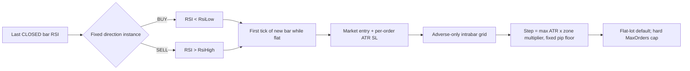
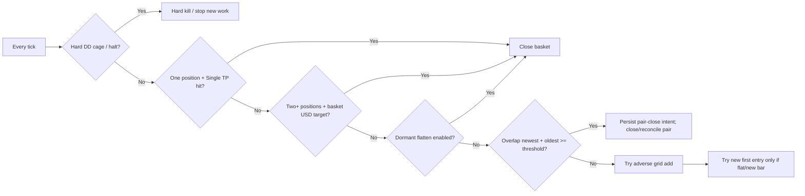

# B16 KangarooGrid — Source-Bound Mechanism Workflow

Status: `D1 RESEARCH WORKFLOW / VISUAL_ONLY_NO_AUTHORITY`
Family: `Boss_16_KangarooGrid / LAB_ENTRY_16`
Finalization canonical base: `e62001c5a0163c5b65790e13010b3e56bd657714`
Build/source lineage: `cf32ba8d32a8292e8f7b5ad2ef766e3442b20125`
EX5 SHA256: `212de9f292f2b90c24a71875352d81f39878148c57563b7d23b7a76216eb37db`
Parent set SHA256: `7a8e8c78bfbcd245e039a629cceb8914a91531b86db23a2b5bf7c45f5778a782`
Source SHA256: `Boss_16_KangarooGrid.mq5 = e22f64302ea443c5bec14c22fbb4787002f1c88742b9ca30d416040affe4e8d3`.

Generated from `ea_template/core/entries/Entry_KangarooRSI.mqh`, `ea_template/core/entries/Kangaroo.mqh`, exact parent/set evidence, and the B16 mechanism-characterization batch. Unknowns remain unknown; this diagram does not override code or evidence.

## Strategy logic

## Exit / safety ownership

The Kangaroo module is the single exit owner for B16. Shared chassis Exit/Stack/Recovery/Hedge/Basket paths do not run for this build. The default `_16_FlattenOn=false` remained frozen and was not activated in this milestone.

## Modules changed prospectively in characterization

- Direction: `_16_Direction 1 -> 2`.
- Position depth: `_16_MaxOrdersPerSide 10 -> 1/2/4/5`; depth-1 evidence was reused from accepted BT1/BT2/BT3, not rerun.
- Single-position exit: `_16_TpSingleAtrMult 0.35 -> 0`.
- Basket exit: `_16_BasketTpUsdPer01 16 -> 0`.
- Recovery: `_16_OverlapMinUsd 5 -> 0`.
- Absolute spacing floor: `_16_MinDistPips 150 -> 0`.
- Post-four ATR widening: `_16_AtrMultAfter 1.4 -> 0.8`.

## Frozen modules / authority boundary

Frozen throughout: RSI period/thresholds, base lot `0.01`, ladder multiplier `1.0`, max lot/order, per-order SL law, emergency DD input, shared risk-control profile, dormant flatten, deposit/leverage/model, optimization state and HOLDOUT.

The active hard risk cage remained supreme. Four characterization cells produced confirmed `[RISK] HARD KILL` events at approximately 25% DD; those cells are full-window ineligible rather than ordinary losing full-window evidence.

## Known unknowns

- MT5 HTML history does not identify which exit branch closed each ordinary ticket; exit attribution comes from one-change counterfactuals, not inferred comments.
- Native intratrade equity/underwater time series is not exported in a machine-readable table; selected report visuals therefore use explicitly labelled closed-deal balance/DD proxies while native EqDD remains the authoritative DD field.
- ATR-normalized realized grid span is not reconstructed because contemporaneous ATR at every entry is not present in report history.
- Model-4, Monte Carlo, HOLDOUT and production broker portability are outside this R2 milestone.
- `KINT-001` and authoritative A/B/C/D grade mappings remain unresolved elsewhere.

Rendered companion: `factory/runs/b16_characterization_20260830/final_report/b16_mechanism_workflow.svg`.
