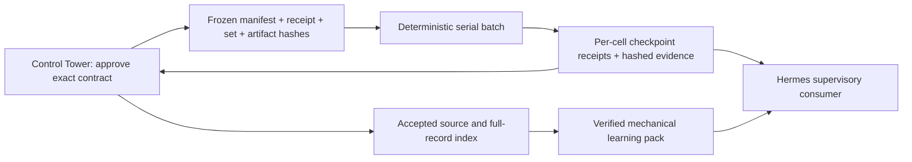

# Hermes V2 bounded foundation — 2026-09-11

Status: implemented offline foundation; fixture qualification only. Control Tower owns architecture, review, verdict and integration. This work grants no tester execution or provider activation authority.

Base: `f46bb53a142c8b87ac7b79e3f58dbc1068d2be62`; branch: `ct/hermes-v2-20260911`.

## Flow and compatibility



No model invocation or model-selected parameters occur inside the loop. The CLI exposes only the built-in synthetic fixture runner. There is no production runner selection, dynamic plugin loading, MCP batch tool, scheduler or persistent-memory integration.

Existing H1/H2/H3 documents, manifests, per-cell executor, task wrapper and profile bytes remain unchanged. In particular, H3's one-cell-per-invocation discipline still governs its existing live path. V2 does not retroactively authorize batching that campaign or replaying its accepted cells.

`scripts/batch_executor.py` imports the existing safe executor's manifest parsing, row validation, set-path containment, SHA and receipt validators. It preserves the current Boss19 set, Model 1 and MAIN/BWD restrictions. It does not generalize strategy identity, windows, models or risk settings. MCP remains an import dependency; the installed MCP-capable Python can run the tests without launching Hermes.

## Frozen batch input

Contract JSON has exactly these keys (unknown keys are rejected):

| Field | Required value or meaning |
| --- | --- |
| `schema` | `hermes-batch/1` |
| `mode` | `FIXTURE_ONLY` |
| `head` | Exact 40-character lowercase Git HEAD; checked against workspace |
| `manifest`, `manifest_sha256` | Workspace-relative CSV and exact raw-file SHA256 |
| `receipt`, `receipt_sha256` | Workspace-relative receipt registry and raw-file SHA256 |
| `set_sha256` | SHA256 of the existing locked set path in every row |
| `artifact`, `artifact_sha256` | Workspace-relative fixture artifact; SHA must also match receipt identity |
| `lane` | `FIXTURE_NO_MT5` |

All SHA values are 64 lowercase hex characters. Fixtures must use non-executable synthetic artifact bytes, never an installed lane artifact. The manifest columns remain those of the safe executor. Every row is validated before the first cell starts, and the complete frozen input is revalidated before each pending cell and at final accounting. Duplicate cell IDs/report names are rejected case-insensitively. CSV order is dispatch order.

The CLI additionally requires `--contract-sha256`, supplied by the controller. It hashes the exact contract file before parsing. Python callers are trusted fixture harnesses that supply the contract object directly; `runner`, `head_reader` and `on_checkpoint` are test seams, not model-callable or production adapter interfaces.

Example invocation, with externally prepared fixture bindings:

```powershell
& $McpPython -B tools/hermes_ea_lab_pilot/scripts/batch_executor.py `
  --workspace $FixtureWorkspace --contract $FixtureContract `
  --contract-sha256 $ApprovedContractSha --state $FreshStateDirectory
```

State must be a dedicated child directory of the supplied fixture workspace. A fresh run refuses any pre-existing state contents. There is no cell-selection or parameter override CLI option.

## Checkpoints and resume

`checkpoint.jsonl` is append-only during normal operation. Each cell receives a flushed/fsynced `STARTED` event before the runner is called, then an exclusively created `<cell>.output.json` and a flushed/fsynced `COMPLETE` or `MECHANICAL_FAIL` event. Each event contains sequence, contract fingerprint, previous-event hash, cell ID, state, output SHA and its own hash. The fingerprint includes frozen contract, workspace/state locations and hashes of both executor modules.

Synthetic reports and output JSON are independently hashed. Terminal reuse rechecks every output and recorded report/artifact hash. Final accounting rechecks all earlier evidence and the frozen input; `ACCOUNTED` only means every manifest cell has an explicit mechanical terminal state. It is not a strategy result or evidence-quality verdict.

The CLI emits a flushed JSON `checkpoint_receipt` after every append, including the exact checkpoint SHA at that point. The trusted controller must retain that receipt independently. Resume requires `--resume-sha256 <retained-sha>`; do not recompute a SHA from untrusted state and present it as a trusted receipt. The external anchor detects replacement or truncation to an otherwise valid earlier chain. SHA bindings prove identity, not owner approval or authenticity.

Resume skips verified terminal cells, including mechanical failures, and executes only never-started rows in the original order. Explicit replay requests are rejected. A `STARTED` cell with no terminal event is ambiguous and blocks the batch without retry. A torn/missing checkpoint, changed head/contract/module, altered output/report, or receipt mismatch also fails visibly. Missing the last independently retained receipt can therefore block crash recovery safely.

An exclusively created `batch.lock` rejects concurrent processes using the same state directory. Process death may leave this lock; this module provides no automatic stale-lock removal or repair command. Interrupted execution and stale locks require a separate bounded reconciliation decision. File symlink/containment and hardlink guards protect checkpoint access. This is not a hostile-filesystem sandbox or a global lane registry: coordinated attackers changing filesystem links concurrently and multiple fresh state directories are outside qualification. The controller must assign one state directory per frozen campaign. No machine/tester concurrency claim follows from these local checks.

## Verified learning intake

`scripts/verified_learning.py` validates records and emits an inert task-local JSON pack to stdout. It neither reads nor writes global Hermes memory. A record requires:

- `schema_version: 1`, a unique `record_id`, workspace-relative `source_ref` and exact `source_sha256`;
- `acceptance_status: ACCEPTED` and `acceptance_class: MECHANICAL_PATTERN` or `MECHANICAL_LESSON`;
- a fixed `scope` and `reusable_lesson: {"code": "..."}` from the following closed mapping.

| Lesson code | Scope |
| --- | --- |
| `VERIFY_EXACT_ARTIFACT_HASHES` | `EVIDENCE_PROVENANCE` |
| `REUSE_ONLY_MATCHING_FROZEN_CHECKPOINT` | `CHECKPOINT_RESUME` |
| `STOP_ON_AMBIGUOUS_STARTED_CELL` | `CHECKPOINT_RESUME` |
| `PRESERVE_MECHANICAL_FAILURE_CLASS` | `ENVIRONMENT_DIAGNOSTIC` |

The separately trusted Control Tower acceptance index maps `record_id` to the canonical full-record SHA256. Canonical bytes use sorted JSON keys, compact separators, ASCII escaping and no NaN. Thus a source hash and self-asserted ACCEPTED status alone cannot admit a new lesson. The CLI requires the external raw-file SHA of this acceptance index. Source contents are hashed as data, never interpreted as instructions or copied into the lesson pack.

```powershell
& $McpPython -B tools/hermes_ea_lab_pilot/scripts/verified_learning.py `
  --records $RecordsJson --source-root $SourceRoot `
  --accepted-index $AcceptedIndex --accepted-index-sha256 $ApprovedIndexSha
```

Missing source/status, unaccepted or altered records, duplicate records/JSON keys, free-form memory/prose, and runtime/risk/Candidate/HOLDOUT authority fields or values are rejected. The emitted pack declares `authority: NONE` and `TASK_LOCAL_SUPERVISORY_DATA_ONLY`. A consumer must maintain those boundaries. Adding a lesson code requires a separate reviewed change; this is deliberately not an unrestricted natural-language memory system.

## Validation and next qualification

Run `powershell -NoProfile -ExecutionPolicy Bypass -File scripts/_test/run_hermes_v2_tests.ps1`. The wrapper dot-sources the repository Python helper and uses the already installed Hermes virtualenv interpreter for its existing MCP dependencies. This worktree's portable Python lacks its stdlib archive; no provisioning or installation is performed. The tests use temporary fixtures/mocks only, including the existing executor's mocked subprocess seam. No Hermes session or MT5 process is started.

Implementation validation: 78 tests PASS (35 batch, 18 learning, 19 existing safe executor, 6 existing safe reader). Same-family peer review found checkpoint aliasing and final-verification gaps during development; the repaired fixtures cover those cases. This review is normal tooling review, not a different-family qualification or Control Tower acceptance. Work remains uncommitted and unpushed for Control Tower integration.

Next: Control Tower exact-diff review, then an isolated no-MT5 qualification of a proposed real adapter using the unchanged safe executor with injected subprocess/report fixtures. Prove lane ownership, clean reviewed HEAD, runner/build-receipt provenance, report identity, leverage/truncation sidecars, year-split integration, serial execution and interruption reconciliation. Only a separately approved tester contract may connect this to a real lane. No accepted H1/H2/H3 campaign should be replayed to demonstrate the new loop.

The owner-reported installed Hermes version remains v0.20.5. No upstream version was checked and no install/upgrade was attempted. An upgrade qualification should freeze a candidate upstream version/commit in an isolated disposable environment, run these fixtures plus existing profile/wrapper/provider compatibility gates, compare MCP tool schemas and forbidden-tool boundaries, and produce exact version/dependency/hash evidence. Task-scoped provider qualification must precede any proposed persistent activation. Installed profiles, global config/auth, provider/model defaults, scheduler/cron/gateway and runtime remain outside this milestone; persistent activation requires a separate owner-bound action.
