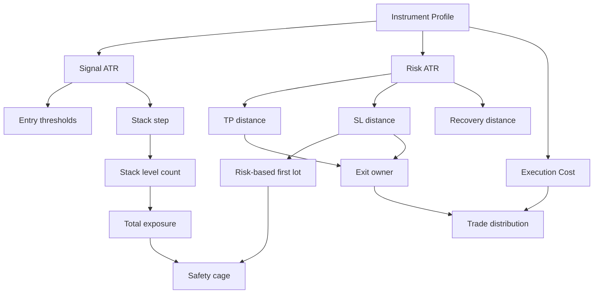

# EA Template V2 — Optimization & Test Procedure

> ⚠️ canonical entry = `PROJECT_STATE.md` · ไฟล์นี้ owns: **ขั้นตอนการ optimize/test ของแม่พิมพ์ V2 เท่านั้น**
>
> 🚫 **ไฟล์นี้ไม่ own verdict.** เจ้าของ verdict คนเดียว = **VERDICT GATE ใน `CLAUDE.md`** (canonical vocabulary:
> `DEAD-STRUCTURAL · DEAD-OPTIMIZED · PARKED-VERIFY(user) · BUILD-ON · CANDIDATE · DEMO · LIVE` + bar table
> หนึ่งเลขต่อ transition) · rescue ladder ฉบับที่ใช้จริง = skill `backtest-optimize-rigor` (owns THE LADDER 0-9).
> ป้ายสถานะทั้งหมดในไฟล์นี้ (§13) = **pipeline-stage label ภายใน ห้ามเขียนลง scorecard/verdict** — ตาราง map
> อยู่ที่ §13.0 (reconciliation ORDER-152, 2026-07-23)
>
> **สถานะ: DRAFT FOR REVIEW** (เนื้อ procedure ยังรอ review — banner ด้านบนคือส่วนที่ตัดสินแล้ว)
>
> เอกสารนี้เสนอ procedure กลางสำหรับ `core/` + `Boss_*.mq5` เพื่อแก้ปัญหา parameter เยอะ, mode ซ้อนกัน, symbol profile ปนกัน และการ optimize ซ้ำโดยไม่รู้ว่า hypothesis คืออะไร
>
> หลัง Claude/user review แล้วจึงค่อยย้ายข้อสรุปที่ตกลงกันไปเป็น order และปรับ script/`.set` ให้บังคับตามเอกสารนี้

## 1. หลักการใหม่

ห้ามมอง dropdown ทุกตัวเป็น parameter ชุดเดียวกัน

```text
Instrument Profile
        ↓ fixed baseline
Entry Architecture × Exit Architecture × Stack Architecture × MM Architecture
        ↓ one hypothesis
Coarse Screen → IS Optimize → Plateau/Neighbour Check
        ↓
OOS / Year Split → M4 Confirmation → Stress / Monte Carlo → Symbol Transfer
        ↓
Demo Candidate → User/Claude Verdict
```

คำสำคัญ:

- **Instrument Profile** = สเกล, digits, ATR context, spread, session และ baseline risk ของสินค้า
- **Architecture** = การเลือก Entry/Exit/Stack/MM/Recovery/Hedge เป็นชุดที่มีความหมาย
- **Parameter** = ค่าภายใน architecture ที่มี causal path ต่อพฤติกรรม
- **Hypothesis** = คำอธิบายสั้น ๆ ว่าทำไม architecture นี้ควรมี edge ใน profile นี้
- **Candidate** = ผลที่ผ่าน gate ของ stage หนึ่ง ยังไม่ใช่ verdict

## 2. ปัญหาของ workflow เดิม

### 2.1 Mode selector ถูกปนกับ continuous parameter

เช่นการ optimize พร้อมกันระหว่าง:

- `ExitMode`
- `SLMode`
- `StackMode`
- `LotProg`
- `RecoveryMode`
- `HedgeMode`
- TP/SL/step/multiplier ทุกตัว

ทำให้ optimizer เลือกทั้ง “ชนิดของ strategy” และ “ค่าของ strategy” ในครั้งเดียว ผลที่ได้อาจดีจาก interaction ที่อธิบายไม่ได้ และจำนวน combination โตแบบคูณกัน

### 2.2 Parameter หลายตัวมีหน้าที่คล้ายกันหรือคนละ context

ตัวอย่างที่ต้องแยกให้ชัด:

| Parameter | Context จริง | ห้ามตีความรวมกับ |
|---|---|---|
| `_0_ATR_Period`, `_0_ATR_TF` | Signal ATR และ Stack step | Risk ATR |
| `_3_RiskATR_Period`, `_3_RiskATR_TF` | SL/TP/sizing/recovery distance | Signal ATR |
| `_21_TP_Pip` | fixed price distance | `_22_TP_ATRmult` |
| `_31_SL_Pip` | fixed price distance | `_33_SL_ATRmult` |
| `_9_StepATRmult` | ระยะห่างของ Stack | `_8_StepATR` recovery |
| `_8_TriggerATR`, `_8_StepATR` | เพิ่มไม้เพราะ basket ขาดทุน | Stack add ตาม signal/distance |
| `_2_BasketTP_Money` | เป้ากำไร basket แบบเงิน | per-leg TP |
| `_2_BasketTP_ATRmult` | เป้ากำไร basket ตาม Risk ATR และ lots | `_22_TP_ATRmult` |
| `_52_ProgMult` | progression ของ lot | `_8_RecMult` |
| `_H_TriggerDDPct` | เปิด hedge จาก basket DD | `_32_SL_Money` |

ก่อน optimize parameter ใด ต้องระบุ context และ owner ใน parameter registry ให้ครบ

### 2.3 Fixed pip ปนกับ ATR โดยไม่มี profile

`_21_TP_Pip` และ `_31_SL_Pip` เป็นค่าที่ขึ้นกับ point/digits และ symbol มาก จึงห้ามใช้ค่าเดียวข้าม FX, Gold และ Crypto โดยไม่ระบุ profile

กฎใหม่:

- **ATR mode เป็น baseline ข้าม symbol**
- **Fixed-pip/points mode เป็น instrument-specific experiment**
- ค่าคงที่ทุกตัวต้องระบุหน่วยจริงว่าเป็น `points`, `pips`, `price` หรือ `money`
- ถ้าชื่อในโค้ดไม่ตรงหน่วยจริง ให้ทำ naming/documentation order ก่อนนำไป optimize

## 3. Parameter registry ที่ต้องมี

สร้างตารางกลาง เช่น `ea_template/PARAMETER_REGISTRY.md` หรือ CSV ที่ generate เป็นเอกสาร โดยทุก input ต้องมี:

| Field | ความหมาย |
|---|---|
| Name | ชื่อ input ใน MQL5 |
| Owner | Entry / Exit / Stack / MM / Risk / Recovery / Hedge |
| Context | Signal ATR / Risk ATR / price / money / account DD |
| Unit | points / pips / price / ATR multiple / USD / percent |
| Active when | mode ที่ทำให้ input นี้มีผล |
| Coupled with | parameter ที่ต้อง lock หรือทดสอบคู่กัน |
| Default profile | ค่าเริ่มต้นต่อ instrument class |
| Optimize stage | stage ที่อนุญาตให้ optimize |
| Safe range | ช่วงที่ไม่ขัด safety cage |
| Causal question | คำถามที่ parameter นี้ตอบ |
| Test owner | module/function ที่ใช้จริง |

ตัวอย่าง:

| Name | Owner | Context | Active when | Optimize question |
|---|---|---|---|---|
| `_22_TP_ATRmult` | Exit | Risk ATR | `ExitMode=22` | target ไกลแค่ไหนจึงรักษา expectancy ได้ |
| `_33_SL_ATRmult` | Exit | Risk ATR | `SLMode=33` | stop กว้างพอสำหรับ noise หรือไม่ |
| `_9_StepATRmult` | Stack | Signal ATR | Stack 91/92 | เพิ่มไม้เมื่อ movement มีความหมายหรือเร็วเกินไป |
| `_8_TriggerATR` | Recovery | Risk ATR | Recovery 81–83 | ต้องเสียหายเท่าใดจึงเริ่ม recovery |
| `_52_ProgMult` | MM | lot ratio | `LotProg=52` | lot progression เพิ่ม edge หรือเพิ่ม tail risk |

ถ้าไม่สามารถตอบ `Active when`, `Context` และ `Causal question` ได้ ห้ามนำ parameter นั้นเข้า optimizer

## 4. Instrument Profiles

สร้าง baseline profile แยกจาก strategy `.set` โดย profile ห้ามมี signal optimization ปนอยู่

### 4.1 Profile classes

| Class | Baseline execution | Baseline risk/exit | หมายเหตุ |
|---|---|---|---|
| FX major | spread ต่ำ, ATR H1/M15 ตาม strategy | ATR SL/TP เป็นหลัก | fixed pip ใช้ได้เฉพาะ symbol class เดียวกัน |
| FX JPY/cross | spread และ digits แยกตรวจ | ATR เป็น baseline | ห้าม copy pip value จาก major โดยตรง |
| Gold | spread/contract size ต้องอ่านจาก broker | lot ต่ำ, cap ต่ำ, ATR กว้างกว่า FX | ห้ามใช้ fixed pip แบบ FX |
| Crypto | tick value/min lot/spread แยกเฉพาะ broker | ATR กว้าง, margin cap เข้ม | ต้อง stress spread และ gap มากกว่า FX |
| Index/Oil/Silver | contract specification แยก | ATR/price profile เฉพาะสินค้า | ห้ามรวมกับ Gold เพียงเพราะ digits คล้ายกัน |

### 4.2 Baseline policy

ค่าต่อไปนี้เป็น **screening prior ไม่ใช่ verdict**:

| Profile | First lot | SL baseline | TP baseline | Stack baseline | Fixed-pip baseline |
|---|---|---|---|---|---|
| FX major | fixed 0.01 หรือ risk 0.25–0.5% | `SL_ATR`, ประมาณ 1.5–2.5 ATR | `TP_ATR`, ประมาณ 2–4 ATR | Single ก่อน | OFF |
| FX JPY/cross | fixed 0.01 | `SL_ATR`, ประมาณ 1.5–3 ATR | `TP_ATR`, ประมาณ 2–4 ATR | Single ก่อน | OFF หรือสร้างจาก pip profile |
| Gold | fixed 0.01 และ RC cap เข้ม | `SL_ATR`, ประมาณ 2–4 ATR | `TP_ATR`, ประมาณ 2.5–5 ATR | Single/Trend stack | OFF เป็น default |
| Crypto | broker-min lot หรือ risk ต่ำ | `SL_ATR`, ประมาณ 2.5–5 ATR | `TP_ATR`, ประมาณ 3–6 ATR | Single ก่อน | OFF |

ค่าเหล่านี้ต้องถูก calibrate จาก broker จริงด้วย ATR snapshot และต้องไม่ถูกนำไปสรุปว่าเป็นค่าที่ดีที่สุด

### 4.3 Profile file layout

แนะนำ:

```text
ea_template/sets/profiles/
  FX_MAJOR_BASE.set
  FX_JPY_BASE.set
  GOLD_BASE.set
  CRYPTO_BASE.set
  INDEX_OIL_BASE.set
```

จากนั้น strategy set จึง override เฉพาะ parameter ที่อยู่ใน hypothesis:

```text
profile base + architecture preset + optimized values = candidate set
```

## 5. Architecture matrix

ไม่ให้ optimizer เลือก dropdown ทุกตัวในครั้งเดียว ให้ทดสอบ matrix แบบเป็นชั้น

### 5.1 Entry matrix

| Entry family | Hypothesis | Initial allowed architectures |
|---|---|---|
| Trend | continuation มี edge | RunTrend/Trail + Single/Trend stack |
| Breakout | range expansion มี edge | ATR TP/SL + Single |
| Mean reversion | extreme กลับเข้าค่าเฉลี่ย | basket/controlled DCA + capped risk |
| GridLog/Zeus | distribution จาก range/grid | basket exit + fixed/slow progression |
| Structural/Wave | price structure มี edge | structural SL/TP + Single |
| Momentum/filter | directional impulse มี edge | Single ก่อน แล้วค่อย test stack |

### 5.2 Dropdown matrix

| Layer | Phase แรก | Phase หลังเท่านั้น |
|---|---|---|
| Entry | lock 1 entry ต่อ batch | compare เป็น outer loop |
| Exit | เลือก ATR TP หรือ structural TP หนึ่งแบบ | fixed pip, trail, basket alternatives |
| SL | เลือก ATR/structural หนึ่งแบบ | pip/money/alternate SL |
| Stack | Single | Trend stack, DCA, pyramid |
| Progression | None/flat | Linear/Plus/Log/Multiplier/Fibonacci |
| Recovery | None | Light → Adaptive → Aggressive |
| Hedge | Off | Lock ใน risk study แยก |
| Regime | Off หรือ fixed known gate | optimize gate หลัง edge ผ่าน |
| Protection | fixed profile | sensitivity study เท่านั้น |

### 5.3 Test matrix template

แต่ละแถวต้องเป็น hypothesis เดียว:

| Batch ID | Profile | Symbol | Entry | Exit | SL | Stack | MM | Recovery | Hedge | Tuned params | Hypothesis |
|---|---|---|---|---|---|---|---|---|---|---|---|
| H001 | GOLD | XAUUSD | Breakout | ATR TP | ATR SL | Single | Fixed | Off | Off | Bars, TP, SL | Gold breakout survives cost |
| H002 | FX_MAJOR | EURUSD | Breakout | ATR TP | ATR SL | Single | Fixed | Off | Off | Bars, TP, SL | FX breakout is not symbol-specific |
| H003 | GOLD | XAUUSD | GridLog | Basket money | ATR/controlled | GridAgainst | Flat | Off | Off | Step, target, levels | range distribution pays after cost |
| H004 | FX_MAJOR | GBPUSD | Trend | RunTrend | ATR SL | Trend stack | Flat | Off | Off | MA, SL, levels | trend extension pays without recovery |

## 6. Staged test procedure

### Stage 0 — Compile and contract smoke

ต่อทุก build ที่เกี่ยวข้อง:

```powershell
powershell -File D:\EA_LAB\ea_template\deploy.ps1 -Compile
powershell -File D:\EA_LAB\ea_template\tests\run_tests.ps1
powershell -File D:\EA_LAB\scripts\tpl_regression.ps1
```

ตรวจ:

- compile 0 errors / 0 warnings
- signal direction
- no-trade conditions
- SL/TP unit
- lot normalization
- max-level and kill behavior
- pending/close behaviorถ้ามี

### Stage 1 — Baseline single run

ใช้ profile base + architecture ที่ lock แล้ว โดยไม่ optimize

ต้องบันทึก:

- trade count
- PF, DD, RF, net
- average win/loss
- yearly distribution
- max consecutive losses
- time in market
- exposure และ lot สูงสุด

ถ้า baseline ไม่มี trade หรือ behavior ผิด ให้แก้ strategy/config ก่อน ห้ามแก้ด้วย optimizer

### Stage 2 — Coarse screen

เปิด parameter 3–4 ตัวเท่านั้น:

- Model 1
- short screen window
- 3–7 values ต่อ parameter
- fixed profile
- protection fixed
- recovery/hedge off เว้นแต่เป็น hypothesis โดยตรง

ผลลัพธ์ stage นี้คือเลือก architecture/profile pair ที่ควรทดสอบต่อ ไม่ใช่ candidate สำหรับ demo

### Stage 3 — Main IS optimization

ใช้ MAIN window ตาม project invariant และปรับเฉพาะ 4–8 parameters ที่มี causal path

กฎ:

- parameter ที่ไม่ active ตาม mode ต้องไม่ถูก optimize
- ไม่ optimize safety input
- ไม่ optimizeหลาย owner พร้อมกันโดยไม่มีเหตุผล
- ใช้ fast genetic เพื่อ screen
- เก็บ optimizer XML, base `.set`, source hash และ batch metadata ทุกครั้ง

### Stage 4 — Robust/plateau selection

ต้องรายงานทั้ง:

- profit-max
- robust survivor
- plateau center
- survivor ratio
- local neighbours
- parameter values ของแต่ละตัว

เลือก plateau center เป็น default candidate แล้วทดสอบ center และ neighbours แบบ single run

### Stage 5 — Forward OOS / backward OOS

ห้ามใช้ OOS เพื่อเลือก parameter ซ้ำหลายรอบจนกลายเป็น IS ใหม่

ต้องทำ:

- forward holdout
- backward OOS เมื่อ regime policy กำหนด
- year split
- compare IS/OOS PF, DD, RF, trades, net

ถ้า OOS fail ให้สถานะเป็น fail/parked ตาม evidence ไม่ขยับ parameter จนกว่าจะตั้ง hypothesis ใหม่

### Stage 6 — Model 4 confirmation

เฉพาะ candidate ที่ผ่าน IS/OOS และ plateau check:

- run real ticks
- ตรวจ fill/trailing/pending behavior
- compare กับ Model 1
- ห้ามรัน Model 4 คู่กับงานอื่นตาม machine policy

### Stage 7 — Stress and portfolio transfer

ก่อนกระจาย symbol:

- spread/commission/slippage stress
- parameter perturbation รอบ center
- Monte Carlo สำหรับ grid/DCA/recovery
- alternate symbol ใน class เดียวกัน
- correlation กับ portfolio ที่มีอยู่

การย้ายไป symbol ใหม่ต้องเริ่มจาก profile base และ candidate parameter center ไม่ใช่ re-opt จนกว่าจะพังแล้วค่อยปรับ

## 7. Batch protocol

### 7.1 Batch หนึ่งรอบ

```text
1. เลือก architecture หนึ่งชุด
2. เลือก profile หนึ่ง class
3. เลือก symbols 2–5 ตัวใน class เดียวกัน
4. ใช้ parameter schema เดียวกัน
5. run coarse screen ทุก symbol
6. เก็บผลลง CSV เดียวกัน
7. เลือก transfer candidates จากความสม่ำเสมอ ไม่ใช่ symbol เดียวที่ดีที่สุด
8. run fine IS/OOS เฉพาะ candidates
9. run M4 เฉพาะ finalists
10. ส่งต่อเข้า correlation/portfolio gate
```

### 7.2 ห้าม batch แบบนี้

- Gold + EURUSD + Crypto ใน optimizer เดียว
- Breakout + DCA + Hedge ใน pass เดียวโดยไม่แยก hypothesis
- ใช้ fixed pip value เดียวข้าม symbol class
- optimize `_22_TP_ATRmult` และ `_2_BasketTP_ATRmult` พร้อมกันโดยไม่กำหนด exit owner
- optimize `_9_StepATRmult` และ `_8_StepATR` พร้อมกันโดยไม่แยก Stack กับ Recovery
- ใช้ holdout เพื่อเลือกซ้ำหลายรอบ

## 8. Standalone migration

Standalone EA เช่น Zeus ต้อง migrate เข้า template แบบสามขั้น ไม่ใช่ copy code แล้ว optimize ทันที

### Step A — Behavior inventory

ทำตาราง mapping:

| Standalone behavior | Template owner | Input | Test |
|---|---|---|---|
| entry signal | `core/entries/` | entry-specific inputs | signal parity |
| grid step | `Stack.mqh` | `_9_*` | step parity |
| lot progression | `MoneyManagement.mqh` | `LotProg`, `_5x` | lot sequence |
| basket TP | `ExitManager.mqh` | `_2_Basket*` | target parity |
| partial close | `Execution/ExitManager` | `_2_Partial*` | ticket/retry |
| DD kill | `RiskControl.mqh` | `ProtectLevel`, `RC_*` | kill parity |
| hedge/recovery | `Hedge/Recovery` | `_H_*`, `_8_*` | controlled scenario |

### Step B — Parity test

ก่อน optimize ต้องพิสูจน์:

- signal timing
- direction
- step price
- lot per level
- SL/TP
- basket close
- partial close
- DD/kill behavior

ถ้า parity ยังไม่ผ่าน ผล optimize ของ template ใช้แทน standalone ไม่ได้

### Step C — Template adaptation

หลัง parity ผ่านค่อยตัดสิน:

- behavior ใดคงไว้เป็น default
- behavior ใดเป็น optional lever
- behavior ใดต้องถอดเพราะผิด safety policy
- input ใดซ้ำกับ chassis และควรลบ/alias

Zeus/GridLog ต้องถูกจัดเป็น architecture/profile ชุดหนึ่ง ไม่ใช่เปิดเป็น dropdown ร่วมกับทุก Entry แบบไร้ข้อจำกัด

## 9. Candidate gate

ทุก stage ต้องแยก gate ออกจาก verdict

| Gate | คำถาม |
|---|---|
| Behavior | ทำงานตาม spec หรือไม่ |
| Execution | fill/close/pending ถูกต้องหรือไม่ |
| Safety | cap, DD, margin, kill ผ่านหรือไม่ |
| IS | มีผลลัพธ์ที่พอทดสอบต่อหรือไม่ |
| OOS | edge ไม่หายหรือไม่ |
| Robustness | center/neighbor และ stress ยังพอรับได้หรือไม่ |
| Portfolio | เพิ่ม diversification จริงหรือไม่ |
| Demo | มีหลักฐานพอสำหรับ demo หรือยัง |

ไม่ผ่าน gate ใดให้หยุดที่ gate นั้น ไม่กระโดดไป optimize parameter อื่นเพื่อแก้ผล

## 10. Metadata ที่ต้องเก็บต่อ batch

อย่างน้อย:

```text
batch_id
source_commit
expert
profile
symbol
period
model
window
base_set
optimized_parameters
locked_parameters
architecture
hypothesis
optimizer_xml
robust_pick
plateau_center
neighbours
IS_report
OOS_report
M4_report
year_split
stress_report
MC_report
status
```

ถ้าข้อมูลชุดนี้ไม่มี ให้ถือว่าย้อนตรวจผลไม่ได้ และยังไม่ควรใช้เป็น evidence สำหรับ candidate

## 11. งานที่ควรให้ Claude ทำตามลำดับ

1. สร้าง parameter registry จาก `core/Inputs.mqh` และ trace ไปยัง implementation จริง
2. ทำ active-when/legal-combination matrix ของทุก Boss 11–18
3. แก้ naming/unit ที่กำกวม เช่น Pip/Points/Price/Money
4. สร้าง profile base `.set` สำหรับ FX, Gold, Crypto และกลุ่มอื่นที่จำเป็น
5. สร้าง architecture preset `.set` แยก Entry/Exit/Stack/MM
6. แก้ optimizer ให้เลือก plateau center ได้จริง
7. เพิ่ม guard จำนวน optimized parameters และ reject inactive parameters
8. สร้าง batch manifest/CSV ที่บันทึก hypothesis และ provenance
9. ทำ parity migration procedure สำหรับ standalone Zeus และตัวอื่น
10. ค่อยทำ batch screen ข้าม symbol class เดียวกัน

## 12. ประเด็นที่ต้อง review ก่อนบังคับใช้

รายการนี้ตั้งใจเปิดไว้ให้ Claude/user ตัดสิน:

- ตัวเลข baseline ของแต่ละ profile จะใช้ค่าใดจริง
- trade floor ต่อ architecture ควรเป็นเท่าไร
- gate PF/DD/RF แยกตาม strategy อย่างไร
- symbol class ใดให้ทำก่อน
- Zeus parity ต้องครบกี่ behavior ก่อนถือว่า migrated
- fixed-pip mode จะเก็บเป็น feature หลักหรือย้ายเป็น legacy/specialist mode
- ใช้ `OnTester()` custom criterion หรือให้ post-processing เป็น gate หลักต่อไป

หลักใหญ่ที่ควรยึดร่วมกัน:

> **หนึ่ง batch = หนึ่ง hypothesis · หนึ่ง profile = หนึ่งหน่วยสเกล · หนึ่ง optimizer = parameter ภายใน architecture เดียว · ทุก candidate ต้องผ่าน OOS และ execution gate ก่อนกระจายต่อ**

## 13. Fail ไม่เท่ากับ Dead — Rescue Optimization Ladder

### 13.0 ⚠️ ป้ายในบทนี้ = stage label ไม่ใช่ verdict (reconciliation ORDER-152, 2026-07-23)

ป้ายใน §13.1 (`SCREEN_FAIL` … `DEAD`) เขียนขึ้นก่อน VERDICT GATE จะถูกตรึงใน `CLAUDE.md`. **ห้ามเขียนป้ายพวกนี้
ลง `EA_SCORECARD_AND_REGISTRY.md` / `EA_MASTER_INDEX` / taskboard verdict** — ใช้ได้เฉพาะเป็นสถานะภายในของ
pipeline/tooling แล้ว **map กลับเป็น canonical vocabulary เสมอ** ก่อนสื่อสารออกไป:

| stage label ในบทนี้ | map เป็น verdict จริง | หมายเหตุ |
|---|---|---|
| `SCREEN_FAIL` · `REOPT_PENDING` · `PROFILE_FAIL` | **ยังไม่ใช่ verdict** (ยังอยู่ใน ladder) | ห้ามสื่อสารเป็นผลตัดสิน — VERDICT GATE ข้อ 2 บอกว่ายังฆ่าไม่ได้ |
| `ROBUST_FAIL` · `OOS_FAIL` | **BUILD-ON** หรือ **PARKED-VERIFY(user)** | ตัดสินตาม bar table: PF>1 ที่ไหนก็ได้ = BUILD-ON |
| `RISK_FAIL` | **CANDIDATE + resize-first** | กฎ user เดิม: cap breach = ย่อไซซ์ก่อน ห้าม reject ตรง |
| `SYMBOL_LOCAL` (§13.7) | **BUILD-ON** (บ้านเดียวที่เจอ) | ไม่ใช่สถานะตาย — doctrine 2b คือขยาย symbol×TF ต่อ |
| `DEAD` (หลัง ladder ครบ) | **DEAD-OPTIMIZED** | ต้องผ่าน last-optimize-before-verdict ด้วย |
| — (ไม่มีในบทนี้) | **DEAD-STRUCTURAL** | ความตายที่ไม่ต้อง optimize — นิยามอยู่ที่ VERDICT GATE เท่านั้น |

**สองอย่างที่บทนี้ยังขาดและต้องไปอ่านที่ VERDICT GATE เสมอ:** (1) **ENGINE-EDGE class** — flat-lot PF<1 ขณะ
escalated PF>1 ไม่ auto-kill แต่ต้องเข้ากรง 5 ข้อ (2) **exit/time lever บน grid ต้อง Model-4 เสมอ**
(บทเรียน ORDER-125: M1 หลอกผ่าน BWD 1.23 → M4 พลิกเป็น 0.85).

### 13.1 หลักการ

การ screen รอบแรกมีหน้าที่บอกว่า **ยังไม่พบหลักฐานใน configuration นี้** ไม่ใช่พิสูจน์ว่า strategy ไม่มี edge

ดังนั้นสถานะต้องแยกเป็น:

| สถานะ | ความหมาย | ทำต่ออย่างไร |
|---|---|---|
| `SCREEN_FAIL` | baseline/ช่วง coarse ไม่ผ่าน | ตรวจ implementation และ parameter coverage |
| `REOPT_PENDING` | ยังมี parameter ที่เกี่ยวข้องไม่ได้ทดสอบ | ทำ rescue optimization |
| `PROFILE_FAIL` | ไม่เข้ากับ symbol/profile นี้ | ส่งต่อ symbol class อื่นตาม mapping |
| `ROBUST_FAIL` | มี peak แต่ไม่มี plateau | ขยาย/เปลี่ยน hypothesis อย่างมีเหตุผล |
| `OOS_FAIL` | IS ดีแต่ forward/backward OOS ไม่รอด | ห้ามแก้ด้วยการ optimize holdout ซ้ำ ต้องลดสถานะหรือเปลี่ยน hypothesis |
| `RISK_FAIL` | edge อาจมี แต่ DD/margin/ruin ไม่ผ่าน | ทำ resize/risk study หรือเปลี่ยน architecture |
| `DEAD` | ผ่าน rescue ladder แล้วไม่มี evidence ที่ควรทดสอบต่อ | ปิด hypothesis นี้พร้อมหลักฐาน |

คำว่า `DEAD` ใช้ได้หลังผ่าน rescue ladder เท่านั้น ไม่ใช้กับผล coarse screen ครั้งแรก

### 13.2 Rescue ladder

```text
Initial screen fail
        ↓
R0: implementation + parameter-linkage audit
        ↓ ถ้ายัง fail
R1: re-optimize relevant parameters / expand sensible range
        ↓ ถ้ายัง fail
R2: test adjacent architecture lever (one change at a time)
        ↓ ถ้ายัง fail
R3: transfer across symbols in same profile
        ↓ ถ้ายัง fail
R4: alternate profile / timeframe / regime hypothesis
        ↓
DEAD หรือ PARKED พร้อม evidence
```

### 13.3 R0 — Implementation and linkage audit

ก่อนยิง optimizer รอบสอง ต้องตรวจ:

- parameter ที่ควร active ถูกเปิด optimize จริงหรือไม่
- parameter ที่ inactive ถูกปิด optimize หรือไม่
- `.set` key ตรงกับ source และ Expert build หรือไม่
- units ถูกต้องหรือไม่: points/pips/price/ATR/money
- Signal ATR กับ Risk ATR สลับกันหรือไม่
- Stack step กับ Recovery step ถูกแยกหรือไม่
- per-leg exit กับ basket exit ซ้อนกันหรือไม่
- optimizer range ครอบค่าที่ reasonable หรือแคบเกินไป
- trade count ต่ำเพราะ signal ไม่เกิด หรือเพราะ entry ถูก gate
- report ใช้ Model/period/date ที่ถูกต้องหรือไม่

R0 ห้ามเปลี่ยน strategy logic ถือเป็นการแก้ test validity เท่านั้น

### 13.4 R1 — Re-optimize เฉพาะ parameter ที่เกี่ยวข้อง

รอบ rescue ต้องไม่เปิดทุก dropdown ใหม่ ให้เลือก parameter ตาม failure hypothesis:

| อาการ | Parameter ที่ควรตรวจ/optimize |
|---|---|
| ไม่มี trade | entry lookback, threshold, session, direction, filter gate |
| PF ต่ำแต่ trade พอ | TP/SL ratio, entry threshold, signal confirmation |
| DD สูง | SL distance, stack step, max levels, risk lot, regime gate |
| net ดีแต่ tail ใหญ่ | stack depth, progression, recovery trigger, basket stop |
| trend strategy แพ้ | MA period, trend filter, exit mode/exit horizon |
| breakout แพ้ | breakout window, confirmation, ATR expansion, session |
| mean-reversion แพ้ | band distance, confirmation, basket target, DCA cap |
| grid รอดเฉพาะ symbol เดียว | step ATR, basket target, max levels, no-progression baseline |

กฎ R1:

- เปลี่ยน parameter group เดียวต่อรอบ
- ขยาย range ได้เมื่อมีเหตุผลจาก parameter semantics หรือ profile scale
- ห้ามเปลี่ยน entry, exit, MM, recovery และ hedge พร้อมกัน
- ต้องสร้าง batch ID ใหม่และเขียนเหตุผลของการ retry
- ต้องเก็บผลรอบแรกไว้ ห้าม overwrite

### 13.5 R2 — Adjacent architecture test

ถ้า R1 ไม่ผ่าน ให้เปลี่ยน architecture ทีละแกน:

```text
Single → Trend stack
Trend stack → Single
ATR TP → RunTrend/Trail
ATR SL → Structural SL
Flat lot → capped progression
Recovery Off → Light recovery
```

แต่ละการเปลี่ยนต้องเป็น hypothesis ใหม่ เช่น:

```text
H001: Breakout + Single + ATR exit
H002: Breakout + Single + RunTrend exit
H003: Breakout + Trend stack + ATR exit
```

ห้ามรวม H001–H003 ใน optimizer pass เดียว เพราะต้องการรู้ว่า architecture ไหนเป็นตัวสร้างผล

### 13.6 R3 — Symbol transfer

ถ้า symbol แรก fail แต่ strategy mechanism ยังสมเหตุผล ให้ทดสอบ symbol อื่นใน profile เดียวกันก่อน

กฎ:

- ใช้ profile base เดียวกัน
- ใช้ architecture เดียวกัน
- ใช้ parameter range เดียวกันใน coarse screen
- ไม่ปรับค่าทีละ symbol ตั้งแต่เริ่ม เพราะจะกลายเป็น symbol overfit
- ถ้าพบผลดีเฉพาะ symbol เดียว ให้ติดสถานะ `SYMBOL_LOCAL` ไม่ใช่ portfolio candidate ทันที

### 13.7 R4 — Alternate profile/timeframe hypothesis

ใช้เมื่อมีเหตุผลชัด เช่น:

- strategy ต้องการ trend แต่ profile เดิมเป็น range-heavy
- signal timeframe สั้นเกินไปเมื่อเทียบกับ spread
- ATR context ไม่ตรงกับ holding horizon
- symbol class มี contract behavior แตกต่างกัน

R4 ถือเป็น hypothesis ใหม่ ต้องเริ่ม baseline และ coarse screen ใหม่ ไม่ใช่เอาค่าที่ดีที่สุดจาก profile เดิมไปยัดทันที

### 13.8 เมื่อใดจึงใช้ DEAD

ให้ใช้ `DEAD` เมื่อครบเงื่อนไขต่อไปนี้:

- R0 audit ผ่าน
- parameter ที่ causal และ active ถูกทดสอบครบตาม registry
- มีอย่างน้อยหนึ่ง re-optimization ที่ reasonable
- architecture ที่ใกล้เคียงถูกทดสอบหรือมีเหตุผลชัดว่าข้ามได้
- symbol/profile ที่เหมาะสมถูกลองตาม scope
- ไม่มี plateau ที่มี robustness
- หรือมี edge แต่ risk/OOS fail และ rescue ที่สมเหตุผลไม่ช่วย

ผล `DEAD` ต้องบันทึก:

- hypothesis ที่ตาย
- symbols/profiles ที่ทดสอบ
- parameter groups ที่ทดสอบ
- ranges ที่ใช้
- Model และ windows
- เหตุผลที่ไม่ทำ rescue ต่อ
- หลักฐานที่ทำให้กลับมาเปิดใหม่ได้ในอนาคต

### 13.9 การยอมช้าอย่างมีระบบ

การยอมให้ backtest หลายรอบเป็นแนวทางที่ถูกสำหรับโรงงานนี้ เพราะ:

- ลดโอกาสทิ้ง edge ที่ยังไม่ได้ test ถูกวิธี
- ทำให้ symbol transfer มีหลักฐานจริง
- แยก failure ของ implementation ออกจาก failure ของ strategy
- สร้าง corpus สำหรับเรียนรู้ parameter linkage และ profile behavior

แต่ความช้าต้องเกิดจาก **coverage ที่ออกแบบไว้** ไม่ใช่การสุ่มลองค่าเพิ่มไปเรื่อย ๆ

ทุก rescue batch ต้องตอบได้ว่า:

```text
รอบนี้แก้ความไม่แน่ใจข้อไหน
เปลี่ยน parameter กลุ่มใด
ทำไมกลุ่มนี้เกี่ยวข้องกับ failure
ผลลัพธ์จะทำให้ตัดสินใจอะไรต่อ
```

หลักปฏิบัติสุดท้าย:

> **อย่ารีบประกาศ DEAD เพื่อประหยัด tester และอย่า optimize ซ้ำโดยไม่มี hypothesis — ให้ใช้ rescue ladder เพื่อซื้อความมั่นใจอย่างตรวจสอบได้**

## 14. Parameter UX Redesign — อ่านง่ายและ link กันได้

### 14.1 หลักการใหม่สำหรับหน้าต่าง Inputs

หน้าต่าง Inputs ปัจจุบันเป็น engineering surface ที่รวม parameter ของ chassis, Zeus, Kangaroo, Wave5 และ MacroGate ไว้ด้วยกัน ผู้ใช้จึงเห็นปุ่มที่ไม่เกี่ยวกับ build และอ่านไม่รู้ว่า parameter ไหนเป็น owner เดียวกัน

เป้าหมายใหม่:

```text
Profile → Entry → Exit → Stack → Sizing → Recovery/Hedge → Safety → Execution
```

แต่ละ input ต้องตอบได้ในบรรทัดเดียวว่า:

```text
มันเปลี่ยนอะไร → ใช้กับ mode ไหน → ใช้หน่วยอะไร → link กับ parameter ใด
```

### 14.2 กลุ่มเลข canonical ที่แนะนำ

ห้ามรีบเปลี่ยนชื่อ key เดิม เพราะ `.set` เก่าจะใช้ไม่ได้ ให้เริ่มจาก group/display ID และ registry ก่อน แล้วค่อยทำ migration เมื่อมี order รองรับ

| กลุ่มใหม่ | ความหมาย | ตัวอย่าง current inputs |
|---|---|---|
| `P0` | Instrument profile / scale | ATR TF, digits policy, spread profile |
| `E1x` | Entry ของ build นั้น | `_12_Bars`, `_13_BB_Period`, `_17_EntryFib` |
| `X2x` | Exit owner | `_21_TP_Pip`, `_22_TP_ATRmult`, basket TP |
| `S3x` | Stop owner | `_31_SL_Pip`, `_33_SL_ATRmult`, structural SL |
| `T4x` | Trade direction/filter/regime | `TradeDir`, `TrendFilter`, `_50_*` |
| `K5x` | Stack/scale-in | `_9_StepATRmult`, `_9_MaxLevels`, confirmation |
| `M6x` | Money management | `FirstLotMode`, `_42_RiskPct`, progression |
| `R7x` | Recovery | `_8_TriggerATR`, `_8_StepATR`, `_8_RecMult` |
| `H8x` | Hedge | `_H_TriggerDDPct`, `_H_ReleaseDDPct`, `_H_Ratio` |
| `C9x` | Safety cage | `ProtectLevel`, `RC_MaxLot`, `RC_MaxLevelsOverride` |
| `Q0x` | Execution/operations | magic, max spread, slippage, persistence |

ตัวเลขเดิมยังคงเป็น compatibility key ได้ แต่เอกสารและ input group ใหม่ต้องใช้ชื่อมนุษย์อ่านได้ เช่น:

| Current | Display label ที่ควรใช้ |
|---|---|
| `_9_StepATRmult` | `K51_StackStepATR` |
| `_8_TriggerATR` | `R71_RecoveryTriggerATR` |
| `_8_StepATR` | `R72_RecoveryStepATR` |
| `_22_TP_ATRmult` | `X22_LegTP_RiskATR` |
| `_2_BasketTP_ATRmult` | `X23_BasketTP_RiskATR` |
| `_33_SL_ATRmult` | `S33_InitialSL_RiskATR` |
| `_31_SL_Pip` | `S31_InitialSL_Points` หรือ rename หลัง migration |

ยังไม่ควรสร้าง duplicate input สองตัวที่เขียนค่าเดียวกันโดยไม่มี migration plan; display alias ต้องมี owner เดียว

### 14.3 Linkage map ของค่าหลัก



กฎ linkage:

- Signal ATR ใช้กับ entry/stack ที่ต้องวัด movement
- Risk ATR ใช้กับ SL/TP/sizing/recovery ที่ต้องวัด risk distance
- `Stack step` ไม่ใช่ `Recovery step`
- `Leg TP` ไม่ใช่ `Basket TP`
- `First lot` ไม่ใช่ `Progression`
- `Max levels` เป็น exposure cap ไม่ใช่ entry quality parameter
- `ProtectLevel`, `RC_MaxLot`, DD kill เป็น safety ceiling ห้าม optimize เพื่อให้ผล backtest สวย

### 14.4 Parameter ที่ควรแยกออกจาก generic chassis

#### Zeus/GridLog-only

ปัจจุบันมีชื่อ Zeus ปรากฏใน shared inputs เช่น `_9_StepMinPips`, `_55_UseLnNotLog10` และ partial/basket behavior หลายตัว

แนวทาง:

- Zeus-specific display group อยู่ใต้ `LAB_ENTRY_14` หรือ preset `ARCH_GRIDLOG`
- generic Stack รับเฉพาะ `step`, `confirm`, `max levels`
- `Entry arm distance` กับ `Stack add distance` ต้องมีชื่อแยก แม้ใช้ ATR เหมือนกัน
- `Basket TP`, partial close และ suppress leg TP ต้องประกาศ exit owner ให้ชัด
- LogPower/Fibonacci/Multiplier ไม่ควรแสดงเมื่อ `LotProg` ไม่ใช่ mode ที่ active

#### Kangaroo-only

`_16_*` เป็น engine ของตัวเอง ไม่ใช่ shared Grid/Recovery/Hedge surface ควรแสดงเป็น `K16 Kangaroo Engine` ทั้งกลุ่ม และซ่อนหรือ mark read-only สำหรับ generic inputs ที่ LabCore ไม่ได้ใช้เพราะ short-circuit

#### Wave5-only

`_17_UseStructLevels=true` ทำให้ generic `ExitMode`/`SLMode` บางส่วนไม่มีอำนาจเหนือ structural anchors ต้องแสดงคำเตือนชัด หรือไม่ expose generic exit controls ใน Boss 17 build

#### MacroGate-only

`_MG_*` เป็น backtest A/B self-gate ไม่ใช่ normal entry filter และไม่ควรอยู่ในหน้าหลักของ live profile ให้ย้ายเป็น advanced research group

### 14.5 Evaluate style ต้องเปลี่ยนชื่อ

คำว่า `Evaluate`, `Mode`, `Confirm`, `Adaptive`, `Aggressive` อย่างเดียวไม่พอสำหรับผู้ใช้ ต้องเปลี่ยนเป็นคำที่บอกกลไก:

| คำเดิม | คำอธิบายที่ควรแสดง |
|---|---|
| Evaluate style | `Signal evaluation timing: closed-bar / intrabar` |
| Stack confirm | `Condition required before adding the next order` |
| Recovery Light | `Capped add-into-loss, one step policy` |
| Recovery Adaptive | `Add size changes with basket loss, capped` |
| Recovery Aggressive | `Multi-step add-into-loss, still cage-capped` |
| RunTrend | `Hold until trend reversal instead of fixed TP` |
| GridAgainst | `Add while price moves against the open basket` |
| GridTrend | `Add while price extends in the basket direction` |
| Pyramid | `Broker pending ladder; pending orders own the add path` |
| Regime filter | `Blocks new entries in selected market states` |

### 14.6 Input visibility policy

ทำเป็น build-specific input surface:

| Build | แสดงหลัก | ซ่อน/advanced |
|---|---|---|
| Boss 11 | Entry 11, ATR exit/SL, Stack 91, basic MM, cage | Recovery/Hedge/Zeus extras |
| Boss 12 | Entry 12, ATR exit/SL, Stack 90, basic MM, cage | DCA/grid/recovery |
| Boss 13 | Entry 13, basket/controlled DCA, SL, cage | Trend-only settings |
| Boss 14 | Entry 14/Zeus, GridLog exit/MM/partial, cage | unrelated generic entry settings |
| Boss 15 | Entry 15, Single, basic exit/SL | grid/recovery/hedge |
| Boss 16 | Kangaroo engine group, cage, execution | generic LabCore exit/stack controlsที่ไม่มีผล |
| Boss 17 | Wave5 group, structural exit, Single, cage | generic exit controlsที่ถูก override |
| Boss 18 | Entry 18, selected stack, exit/SL, cage | unrelated entry groups |

ถ้ายังทำ input visibility แบบ compile-time ไม่ได้ทันที ให้ทำอย่างน้อย:

1. group label ระบุ `ACTIVE ONLY WHEN ...`
2. OnInit WARN เมื่อ input ไม่มีผล
3. parameter registry ระบุ `inactive`
4. optimizer guard ปฏิเสธ inactive keys

### 14.7 10,000 combinations policy

10,000 combinations ยอมรับได้เมื่อเป็น:

- architecture เดียว
- profile เดียว
- parameter group ที่ linkage กัน
- range มีเหตุผล
- output ถูกเก็บ provenance ครบ
- มี budget/time estimate

ตัวอย่างที่ดี:

```text
Boss_12 Breakout + FX_MAJOR
_12_Bars × _12_ConfirmBars × _22_TP_ATRmult × _33_SL_ATRmult
= 10,000 combinations ภายใน hypothesis เดียว
```

ตัวอย่างที่ไม่ดี:

```text
Breakout × MeanRev × Grid × DCA × Hedge × all exits × all MM
= 10,000 combinations ที่ไม่รู้ว่ากำลังทดสอบอะไร
```

### 14.8 Performance budget ต่อ batch

ยอมใช้เวลานานได้ แต่ต้องรายงานก่อนเริ่ม:

| Field | ตัวอย่าง |
|---|---:|
| combinations | 10,000 |
| estimated runtime Model 1 | 2 ชั่วโมง |
| expected finalist ratio | 0.5–2% |
| single-test rechecks | 20–100 |
| M4 confirmations | 3–10 |
| symbols | 3 FX majors |
| decision after batch | เลือก profile/architecture ต่อ หรือ rescue |

ถ้า 10,000 combinations ใช้เวลานานแต่ผลลัพธ์อธิบายไม่ได้ ถือว่า performance ต่ำในเชิง research แม้ tester จะทำงานเร็ว

### 14.9 Definition of understandable parameter

parameter ถือว่า “ผ่าน UX review” เมื่อคนอื่นตอบได้โดยไม่เปิด implementation:

1. มันควบคุมอะไร
2. ใช้กับ build/mode ไหน
3. หน่วยอะไร
4. ค่ามากขึ้นทำให้ behavior เปลี่ยนอย่างไร
5. เกี่ยวข้องกับ parameter ไหน
6. ปิด/ไม่มีผลเมื่อใด
7. อยู่ใน stage ไหนของ optimization

ถ้าตอบไม่ได้ ให้แก้ชื่อ, comment, group, registry หรือ implementation seam ก่อนเพิ่ม parameter ใหม่
